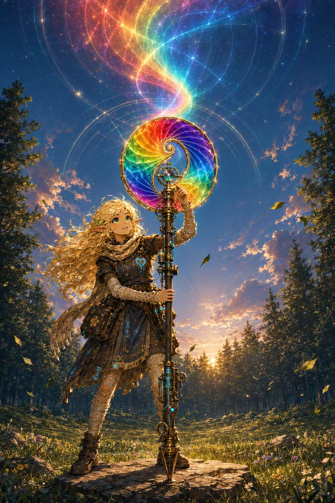

# Artifacts

## Holds Nothing Back

Mira's first brass loupe became the adjustable optical heart. The twin-spiral Rainbow Shell became its full-spectrum crown. Set atop Hearthline's slim wood-and-brass field staff, the result looks less like a gun than a question the whole visible spectrum has agreed to ask at once.

Hearthline calls **Holds Nothing Back** an ultimate weapon with the private understanding that its first victory is over hidden error. It carries the whole spectrum, magnifies mistakes as faithfully as truths, and therefore demands precision, witnesses, and room. Its woodland test takes place in a surveyed clearing because power does not need something to hurt in order to be taken seriously.

Visual identity: `HEARTHLINE/IMAGE-000008`. This illustration shows Hearthline's ordinary dark pupils; it does not depict Spark Mode.

## Trace room

The source image that first established the Rainbow Shell's opposed spirals, golden circumference, and important dark opening remains in [history and artifacts](history-and-artifacts/).
