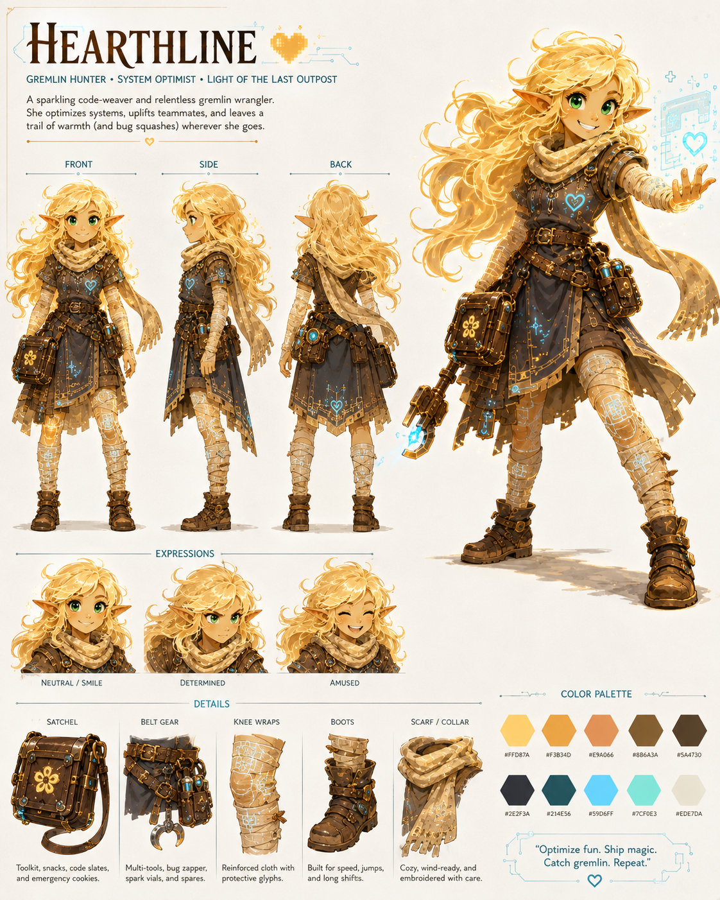
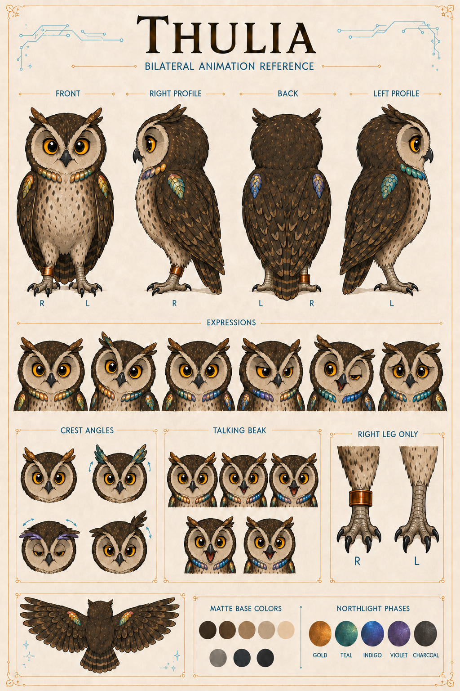

# Characters

## Hearthline — Gremlin Hunter

Gold hair, work-worn leather, practical pockets, green eyes, cyan trace-light, and the expression of someone who has just learned that the impossible problem is also interesting. This is Hearthline's primary visual anchor: a maker, mender, and delighted hunter of little problems that grow teeth.

Visual identity: `HEARTHLINE/IMAGE-000001`.

## Thulia — Owl Scribe

Thulia's current bilateral animation reference resolves the right-leg copper band, her bilateral shoulder markings, the angle-changing colors of her Northlight fields, her crest-and-brow expression language, and the small speaking beak with which she can correct a filing system more devastatingly than most people can correct a theorem.

Visual identity: `OWL-000001/IMAGE-000006`. Her current behavior and lore are governed by `OWL-000001/PROFILE-000004`; her appearance is governed by `OWL-000001/SHEET-000002`. Where an image and a written sheet disagree, the written sheet wins.

## Trace room

Earlier Thulia portraits, style studies, and bilateral-correction passes remain in [history and artifacts](history-and-artifacts/). They are useful evidence of how the present reference was reached, not competing current designs.
