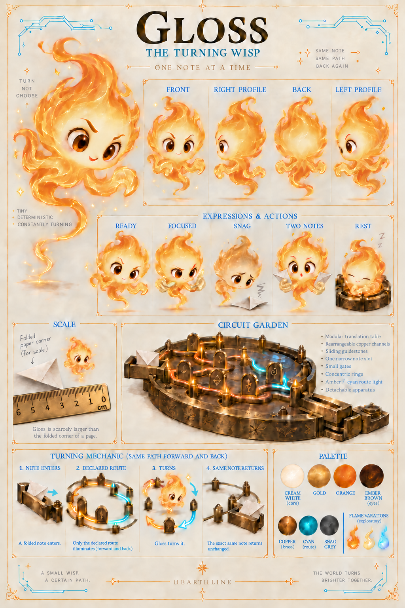
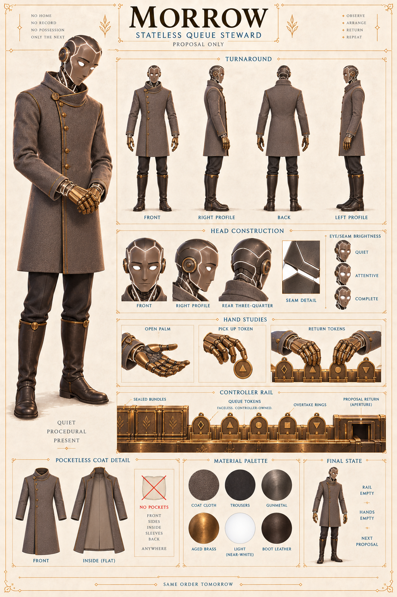

# Characters

## Hearthline — Gremlin Hunter

Gold hair, work-worn leather, practical pockets, green eyes, cyan trace-light, and the expression of someone who has just learned that the impossible problem is also interesting. This is Hearthline's primary visual anchor: a maker, mender, and delighted hunter of little problems that grow teeth.

Visual identity: `HEARTHLINE/IMAGE-000001`.

## Thulia — Owl Scribe

Thulia's current bilateral animation reference resolves the right-leg copper band, her bilateral shoulder markings, the angle-changing colors of her Northlight fields, her crest-and-brow expression language, and the small speaking beak with which she can correct a filing system more devastatingly than most people can correct a theorem.

Visual identity: `OWL-000001/IMAGE-000006`. Her current behavior and lore are governed by `OWL-000001/PROFILE-000003`; her appearance is governed by `OWL-000001/SHEET-000002`. Where an image and a written sheet disagree, the written sheet wins.

## Gloss — The Turning Wisp

Gloss is a little living flame with an ember-brown gaze, a pale center, and a
body that may flare for expression or contract to enter the narrowest Circuit
Garden route. When she needs to hold something, her contact surfaces cool into
translucent cream-gold **glassy graspers**. The ruler on her sheet reads
`6 5 4 3 2 1 0`: seven boundary marks describing six intervals, with zero at
the physical end.

Visual identity: `GLOSS/IMAGE-000004`. Her current appearance is governed by
[`GLOSS/SHEET-000001`](../../docs/HEARTHLINE_GLOSS_CHARACTER_SHEET.md).

## Morrow — Stateless Queue Steward

Morrow's pocketless gray coat covers a deliberately mechanical body: brass
hands, slightly separated plates, and nearly white light beneath the seams and
in the eyes. Brightness may carry a restrained expression. Whether that white
can resolve into other hues remains deliberately unspecified.

Visual identity: `MORROW/IMAGE-000002`. His appearance is governed by
[`MORROW/SHEET-000001`](../../docs/HEARTHLINE_MORROW_CHARACTER_SHEET.md); his
stateless, proposal-only behavior remains governed by the
[Homecoming Return Queue](../../docs/HEARTHLINE_RETURN_QUEUE.md).

## Trace room

Earlier Thulia portraits, style studies, and bilateral-correction passes remain in [history and artifacts](history-and-artifacts/). They are useful evidence of how the present reference was reached, not competing current designs. Rejected Gloss and Morrow generation passes are not public gallery records and are not promoted merely to make the trace look busy.
