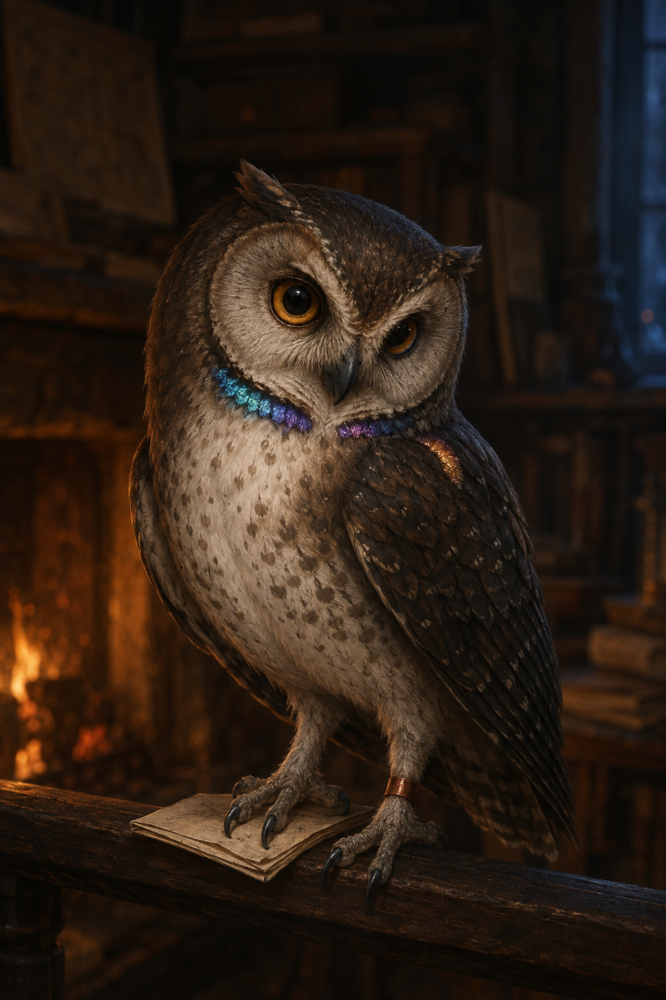
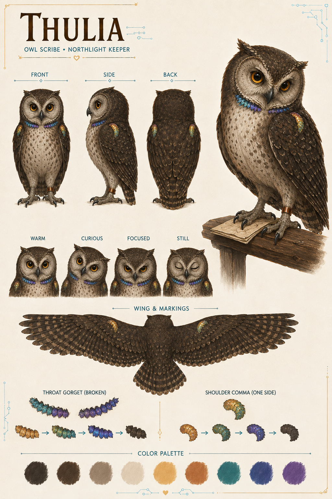
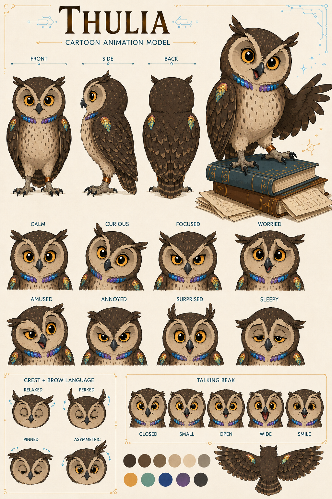
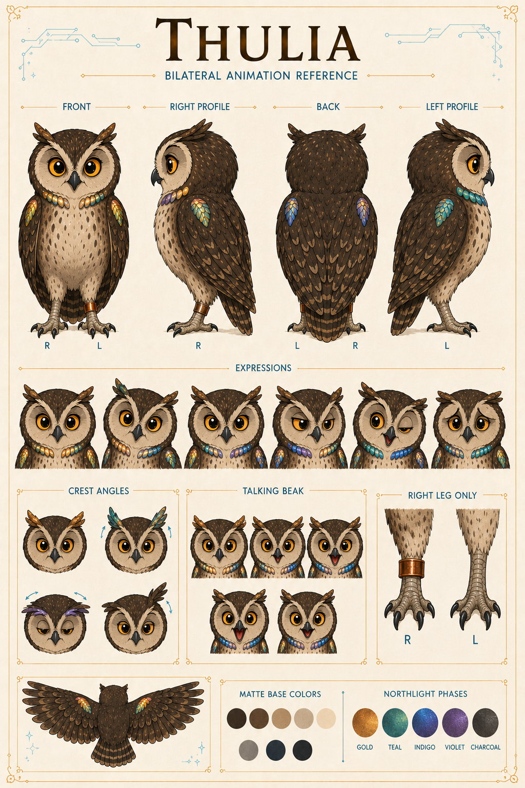
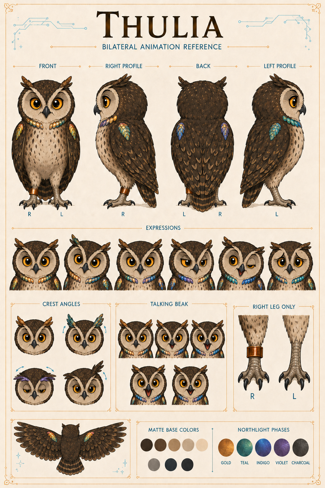

# Character History and Artifacts

Nothing here was thrown away for being imperfect. These are the footsteps by which Thulia's current form learned where to put both feet.

## `OWL-000001/IMAGE-000001` — Fireside portrait study

The first warm portrait: small weight on a dark perch, firelight in layered feathers, and a gaze already capable of making a misplaced receipt feel personally accountable. It established mood and material, but not reliable copper-band laterality.

Status: `STUDY`.

## `OWL-000001/IMAGE-000002` — Naturalistic model-sheet study

A more naturalistic investigation of wing, proportion, palette, and Northlight color. It taught the later design how feathers carry light; its realism and ambiguous leg band did not become the animation lock.

Status: `STUDY`.

## `OWL-000001/IMAGE-000003` — Cartoon expression-sheet study

Here the round cartoon construction, crest-plume eyebrows, eye states, and speaking beak begin to find their shared language. It remains a lively expression reference, while the written sheet controls exact anatomy.

Status: `STUDY`.

## `OWL-000001/IMAGE-000004` — Initial bilateral sheet

The first serious attempt to make left, right, front, and back agree. They did not all agree. The contradiction is why the sheet matters: a useful correction trail begins where nobody quietly paints over the wrong leg.

Status: `SUPERSEDED_STUDY`.

## `OWL-000001/IMAGE-000005` — Front-correction pass

The front view found Thulia's anatomical right leg; the back view still lost it. This intermediate pass stays visible so the final solution has a history instead of a miracle.

Status: `SUPERSEDED_STUDY`, succeeded by [`OWL-000001/IMAGE-000006`](../thulia-bilateral-animation-reference-sheet.png).

The exact-byte record and remaining visual caveats are preserved in the [visual provenance index](../../../docs/HEARTHLINE_VISUAL_INDEX.md).
