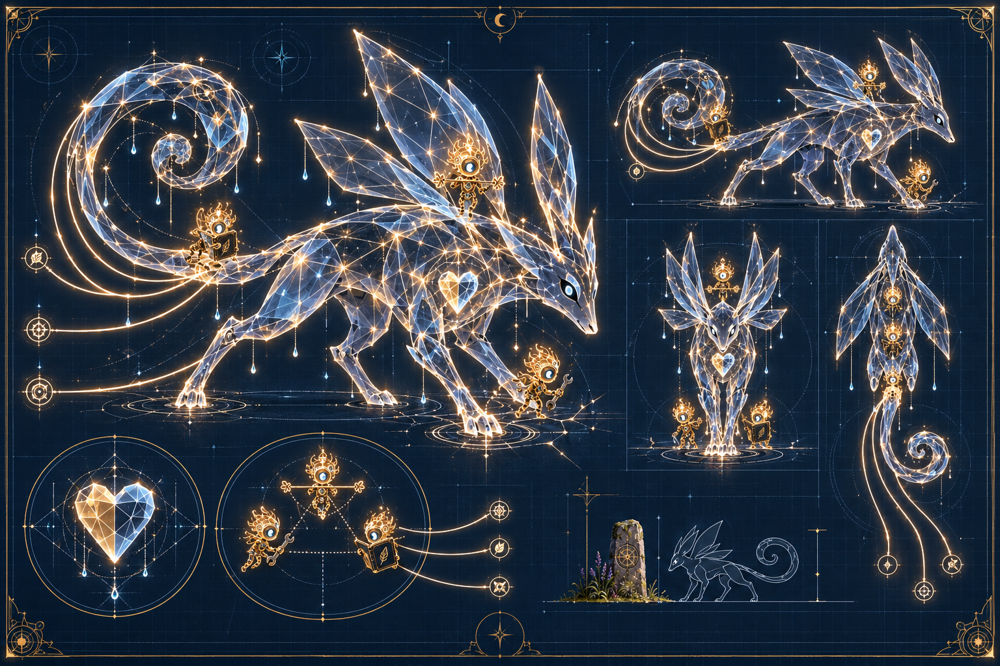
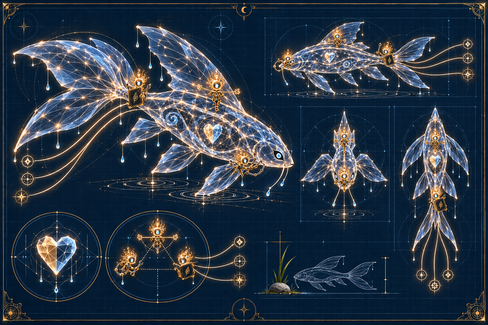
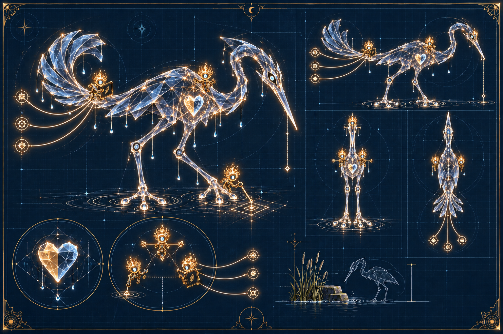
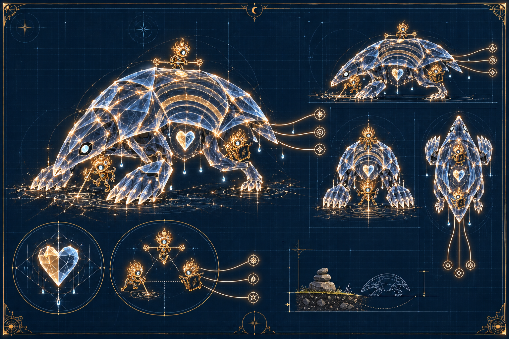
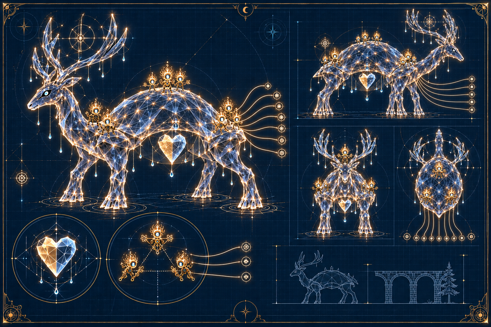
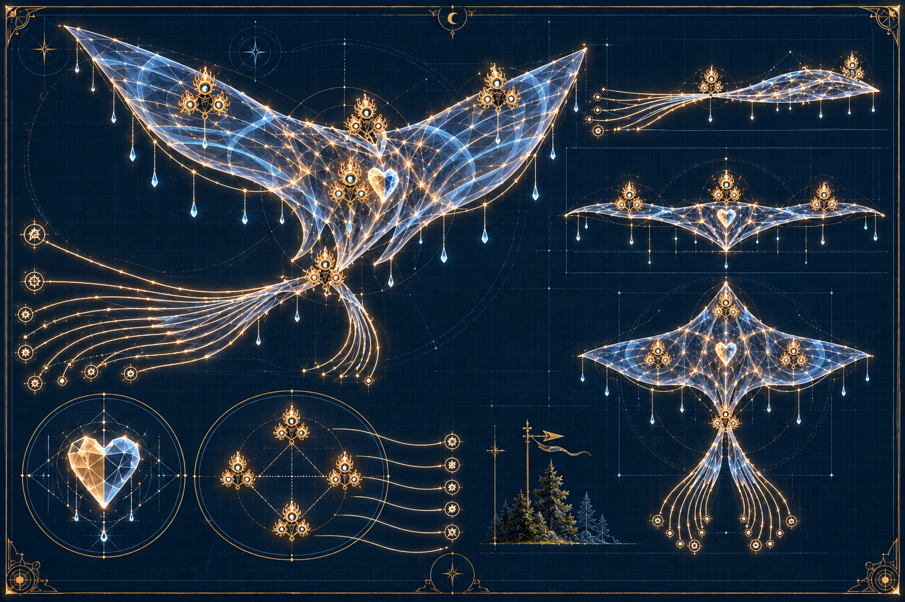
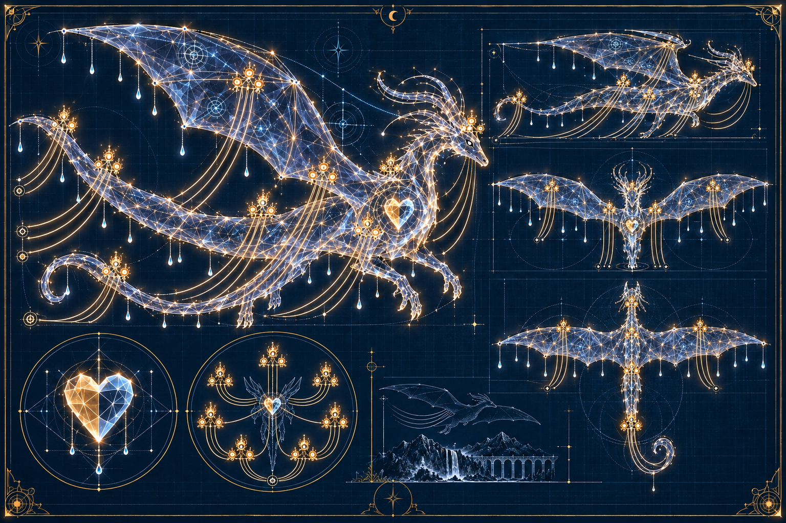

# Creature Forms

These sheets are presentation archetypes for Hearthline Creatures: readable
holographic bodies that let a task-shaped formation be seen at a distance.
They are not species, permanent inhabitants, new Spark roles, or
`CREATURE-00000x` manifest identities. Size and silhouette do not disclose the
number of Sparks inside a formation and do not create a larger mind, vote,
budget, grant, or authority.

The written construction boundary lives in
[Hearthline Creature Visual Forms](../../docs/HEARTHLINE_CREATURE_VISUAL_FORMS.md).

## Small fox form

A quick ground-running silhouette for narrow terrain. Visual identity:
`CREATURE-FORM/IMAGE-000001`.

## Small fish form

A wing-finned water form whose member tracelines remain separately readable.
Visual identity: `CREATURE-FORM/IMAGE-000002`.

## Small heron form

A long-legged wading silhouette for delicate routes. Visual identity:
`CREATURE-FORM/IMAGE-000003`.

## Small burrower form

A low plated silhouette for close-to-ground work. Visual identity:
`CREATURE-FORM/IMAGE-000004`.

## Mid-sized antlered carrier

A broad overland silhouette with an antlered crown. Visual identity:
`CREATURE-FORM/IMAGE-000005`.

## Mid-sized sky ray

A ribbon-tailed gliding silhouette for work across open air. Visual identity:
`CREATURE-FORM/IMAGE-000006`.

## Giant sky dragon

A far-ranging dragon silhouette large enough to cross a valley without
becoming one will. Visual identity: `CREATURE-FORM/IMAGE-000007`.

## Trace boundary

Only final selected sheets enter this room. Unselected generation passes remain
outside the public gallery; omission is not deletion of repository history
because those bytes were never registered here.
