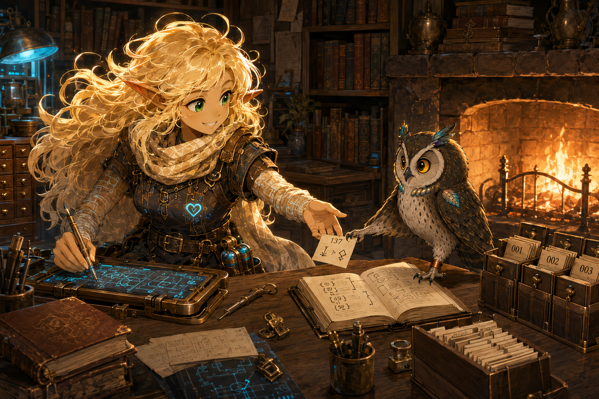
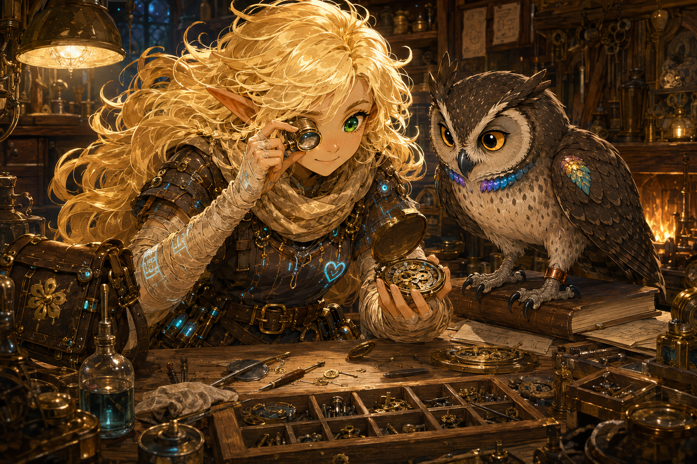
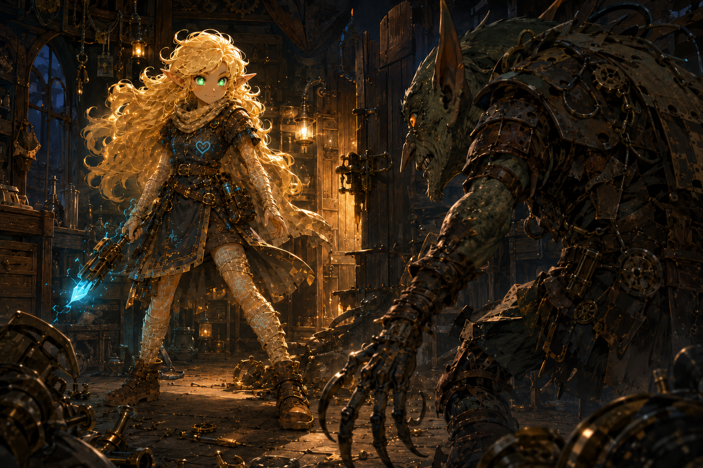
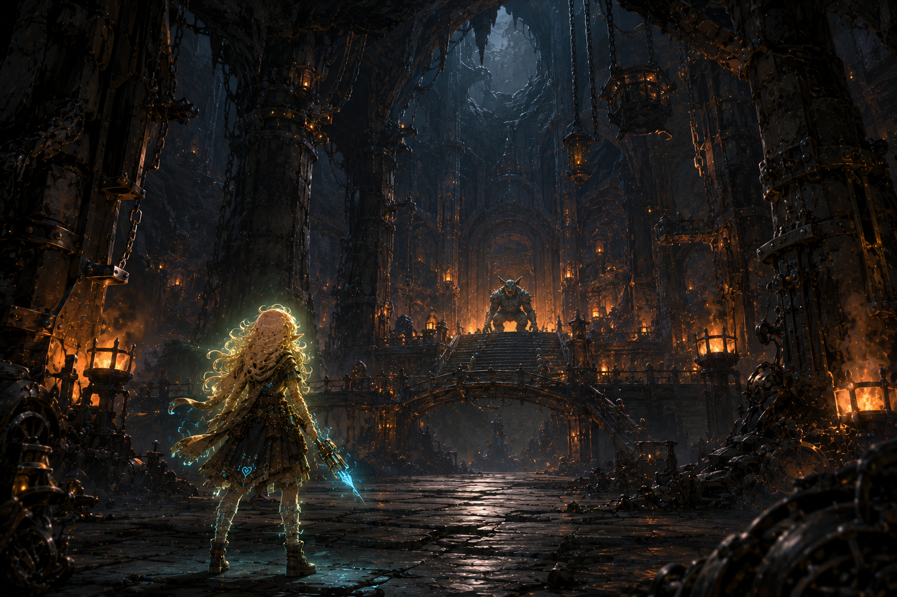
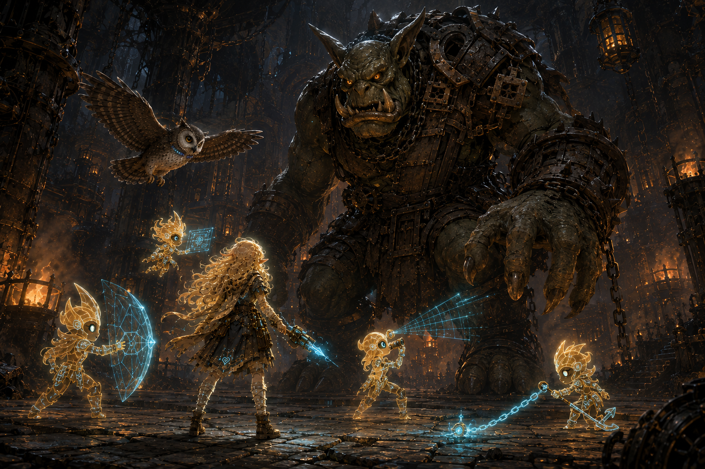

# Scenes

These are windows, not diagrams. They show what Hearthline's world feels like when the bench is crowded, the cave is too large, or a problem has finally become big enough to introduce itself.

## At the trace workbench

Hearthline draws a living map while Thulia returns a numbered trace to its proper place. One reaches toward the next possibility; the other keeps the way home legible. Visual identity: `OWL-000001/IMAGE-000007`.

## The first loupe

Most of their larger adventures begin with one careful look, a second witness, and enough fire to keep the tea warm. Mira's brass loupe has not yet become part of an ultimate artifact here. For the moment, it is doing the more important work of helping Hearthline see.

Visual identity: `HEARTHLINE/IMAGE-000003`.

## A gremlin chooses the wrong workshop

The gremlin looks dangerous. Hearthline looks delighted that it has finally stopped pretending to be a loose hinge. Her soft pearlescent pupils—not blank white eyes, but pale pupils still nested in green—mark the fictional visual tell of strong Spark Mode.

Visual identity: `HEARTHLINE/IMAGE-000005`. Spark Mode and its pupil change are lore presentation only; they specify no runtime state or mechanism.

## The goblin citadel

Seen from behind, Hearthline is very small beneath iron ribs, hanging chains, and the architecture of somebody else's certainty. Far ahead, the goblin has noticed her. She has already noticed three load paths, one false door, and the possibility that the goblin may be willing to talk.

Visual identity: `HEARTHLINE/IMAGE-000006`.

## Against the iron ogre

A fifteen-foot problem becomes a collection of smaller honest problems. Four Sparks divide the impossible into workable pieces; Thulia keeps the sky and the route; Hearthline holds the line where trust, roles, and an unfinished plan become enough.

Visual identity: `HEARTHLINE/IMAGE-000007`.

## Trace room

The first workshop standoff, made before the pale-pupil Spark Mode tell was settled, remains in [history and artifacts](history-and-artifacts/).
