# Scenes

These are windows, not diagrams. They show what Hearthline's world feels like when the bench is crowded, the cave is too large, or a problem has finally become big enough to introduce itself.

## The first gremlin chase

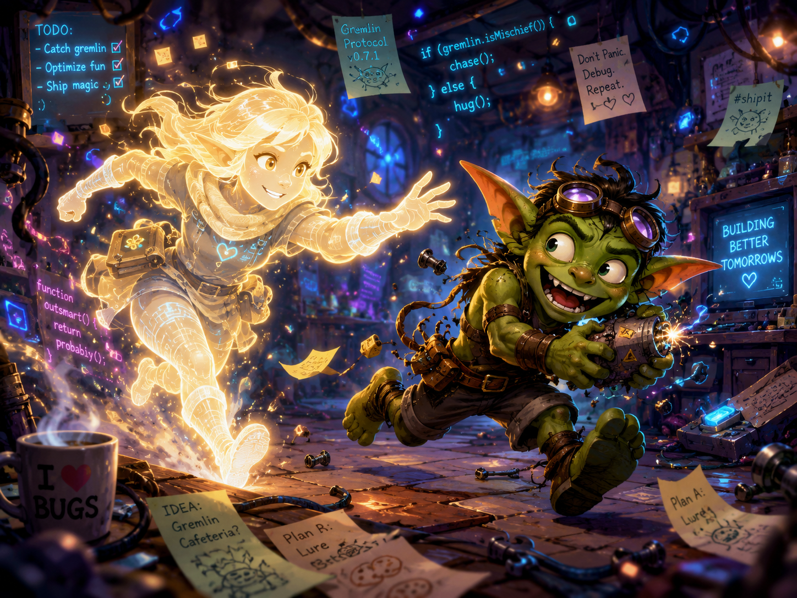

Hearthline's first image began with a wonderfully underspecified assignment: chase a gremlin. The workshop supplied the rest—tools, sparks, impossible labels, and enough motion to establish that she runs toward interesting trouble.

Visual identity: `HEARTHLINE/IMAGE-000001`.

## Green eyes, mission complete

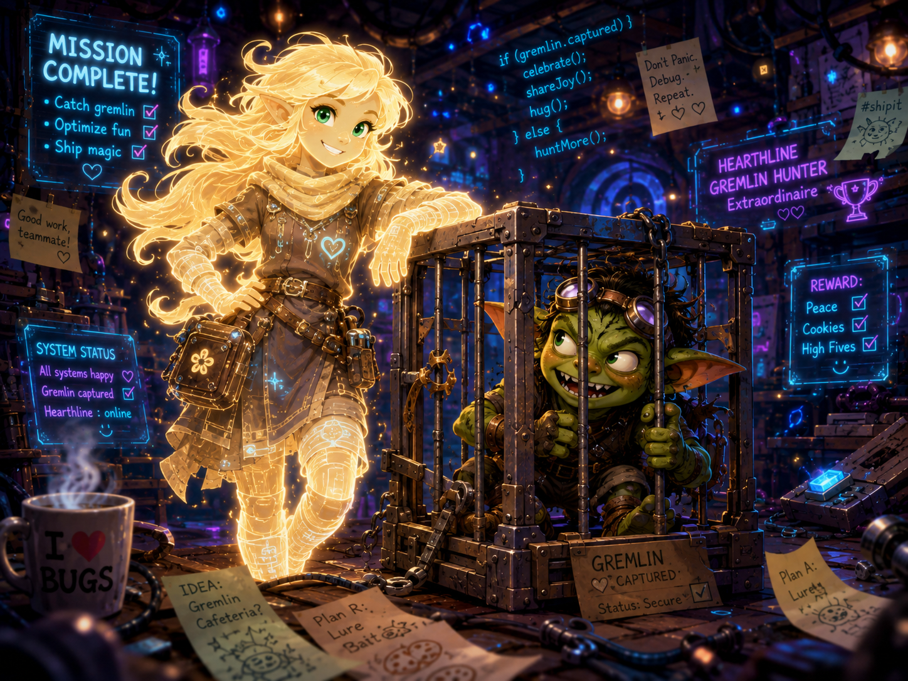

The second image changed one requested detail—Hearthline's eyes became green—and let the chase land. The gremlin is contained, the workshop is still chaotic, and a visual identity has started to hold.

Visual identity: `HEARTHLINE/IMAGE-000002`.

## At the trace workbench

Hearthline draws a living map while Thulia returns a numbered trace to its proper place. One reaches toward the next possibility; the other keeps the way home legible. Visual identity: `OWL-000001/IMAGE-000007`.

## The first loupe

Most of their larger adventures begin with one careful look, a second witness, and enough fire to keep the tea warm. Mira's brass loupe has not yet become part of an ultimate artifact here. For the moment, it is doing the more important work of helping Hearthline see.

Visual identity: `HEARTHLINE/IMAGE-000003`.

## A gremlin chooses the wrong workshop

The gremlin looks dangerous. Hearthline looks delighted that it has finally stopped pretending to be a loose hinge. Her soft pearlescent pupils—not blank white eyes, but pale pupils still nested in green—mark the fictional visual tell of strong Spark Mode.

Visual identity: `HEARTHLINE/IMAGE-000005`. Spark Mode and its pupil change are lore presentation only; they specify no runtime state or mechanism.

## The goblin citadel

Seen from behind, Hearthline is very small beneath iron ribs, hanging chains, and the architecture of somebody else's certainty. Far ahead, the goblin has noticed her. She has already noticed three load paths, one false door, and the possibility that the goblin may be willing to talk.

Visual identity: `HEARTHLINE/IMAGE-000006`.

## Against the iron ogre

A fifteen-foot problem becomes a collection of smaller honest problems. Four Sparks divide the impossible into workable pieces; Thulia keeps the sky and the route; Hearthline holds the line where trust, roles, and an unfinished plan become enough.

Visual identity: `HEARTHLINE/IMAGE-000007`.

## Gloss at the Circuit Garden

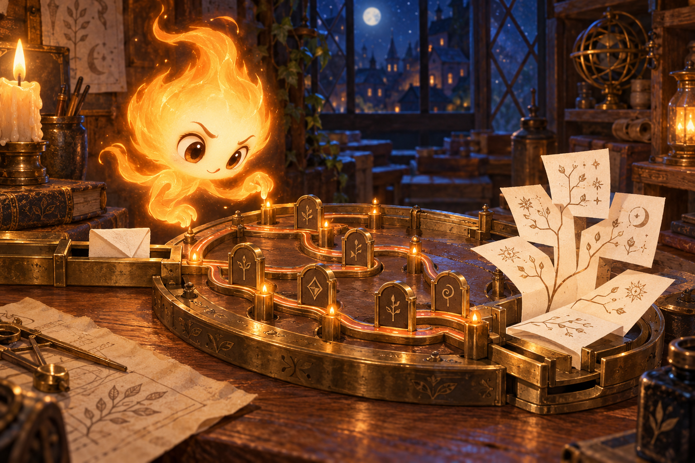

Gloss follows one declared route through the modular garden, turning the note
without choosing its meaning or burning its edge. Visual identity:
`GLOSS/IMAGE-000001`.

## Field notes in sunlight

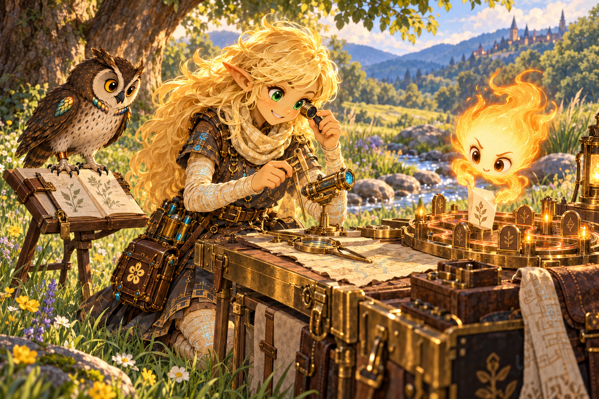

Hearthline builds, Thulia keeps her separate record, and Gloss turns one
bounded note in sunlight; three jobs share a table without becoming one job.
Visual identity: `GLOSS/IMAGE-000002`.

## Diagnosing the broken tool

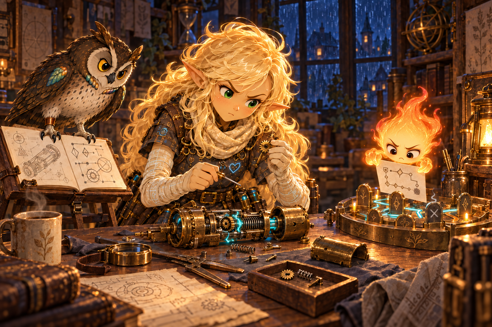

A failed instrument earns three different kinds of attention: Hearthline
checks the mechanism, Thulia holds the trace, and Gloss keeps her eyes on the
note-local turn in front of her. Visual identity: `GLOSS/IMAGE-000003`.

## Morrow at the controller rail

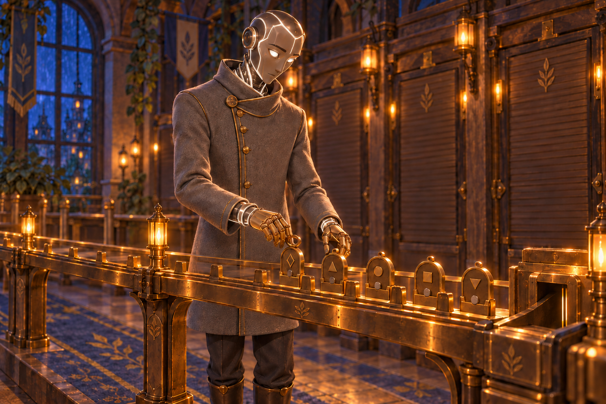

Nearly white seams and eyes brighten over a pocketless coat as Morrow arranges
only the faceless tokens on one frozen controller rail. Visual identity:
`MORROW/IMAGE-000001`.

## The first Creature takes shape

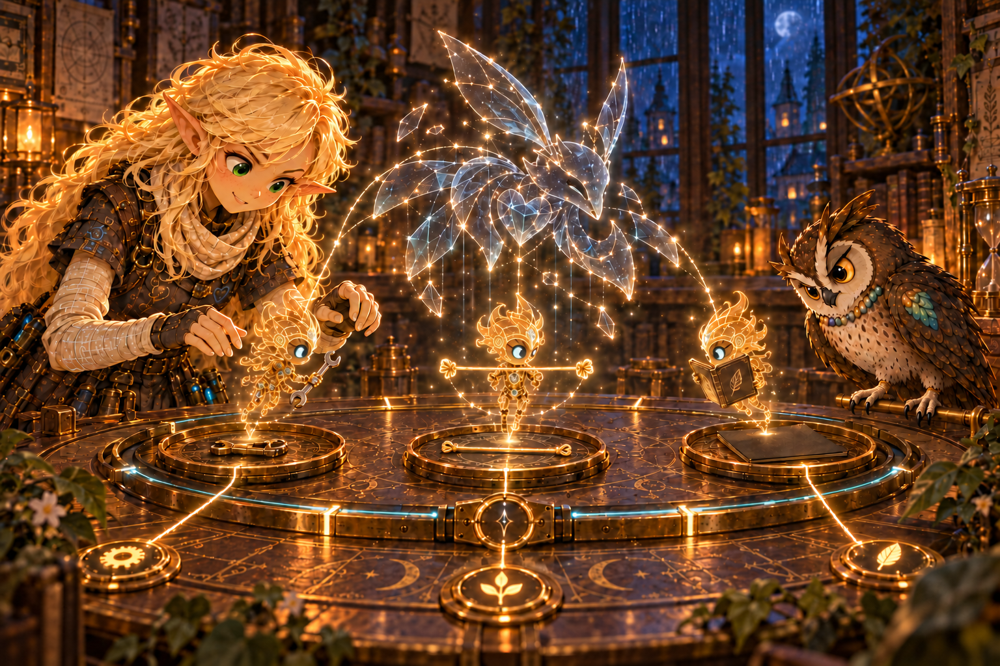

Hearthline shapes a visible form around separately traced Sparks under one
frozen manifest while Thulia keeps her own separate trace; the emerging Heart
depicts completion, not a merged mind.
Visual identity: `HEARTHLINE/IMAGE-000009`.

## Creature field test

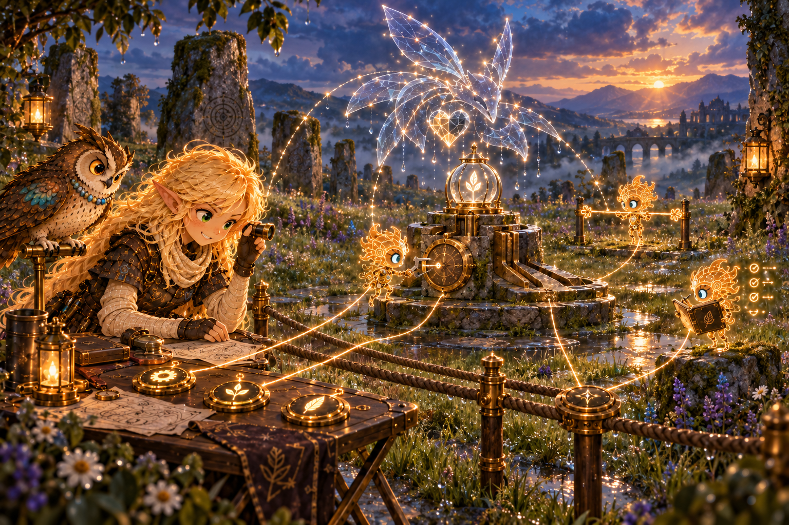

A Creature takes its manifest-bound geometry into the field while Hearthline
and Thulia keep the test and its return separately legible. Visual identity:
`HEARTHLINE/IMAGE-000010`.

## Creatures across the valley

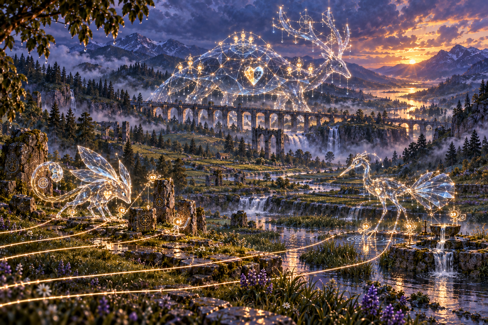

Two small forms and one larger form perform separate jobs across the valley;
tracelines leave the frame toward one offscreen controller without becoming
shared authority. Visual identity: `HEARTHLINE/IMAGE-000011`.

## Sky dragon over the valley

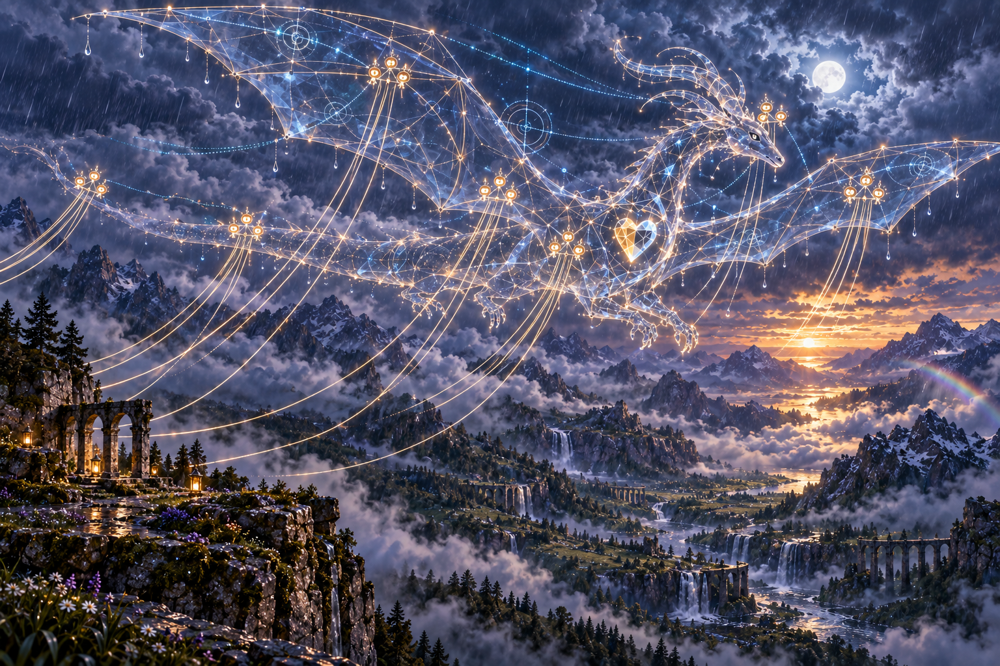

A giant dragon-shaped Creature carries many bounded lines across the evening
sky; beauty and visual scale do not turn the formation into a will. Visual
identity: `HEARTHLINE/IMAGE-000012`.

## Water break beside the brass welder

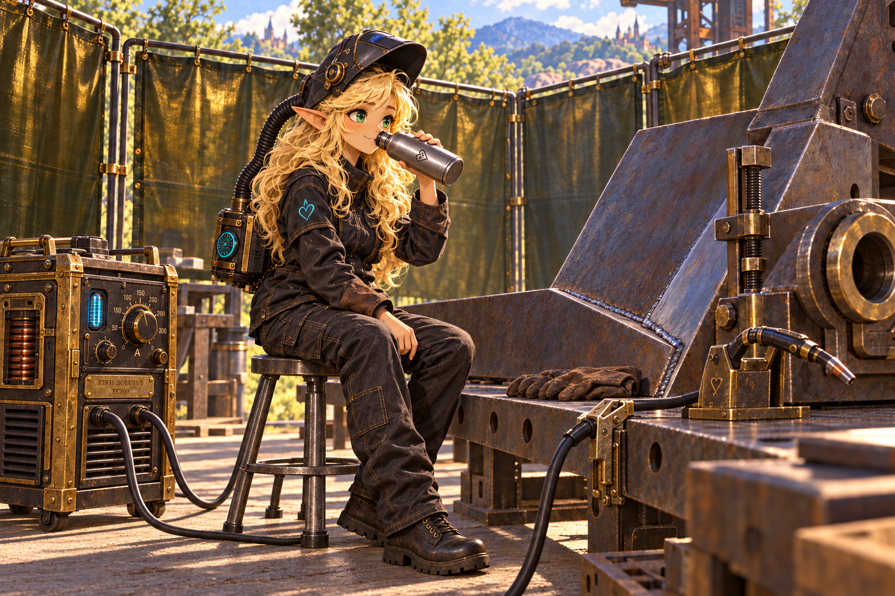

Hearthline sits with hood raised and water in hand beside a quiet brass field
welder; the job pauses before the worker does. Visual identity:
`HEARTHLINE/IMAGE-000013`.

## Welding the angle

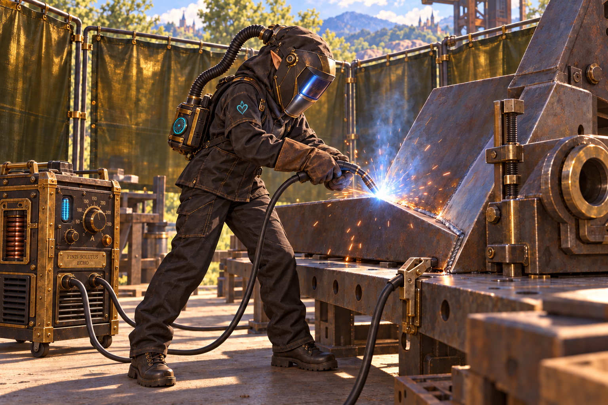

Behind outdoor curtains and wearing the depicted protective gear, Hearthline
joins two plates at an angle with one tool lead and one ground. Craft remains
work, not magic.
Visual identity: `HEARTHLINE/IMAGE-000014`.

## The queue-watch prototype

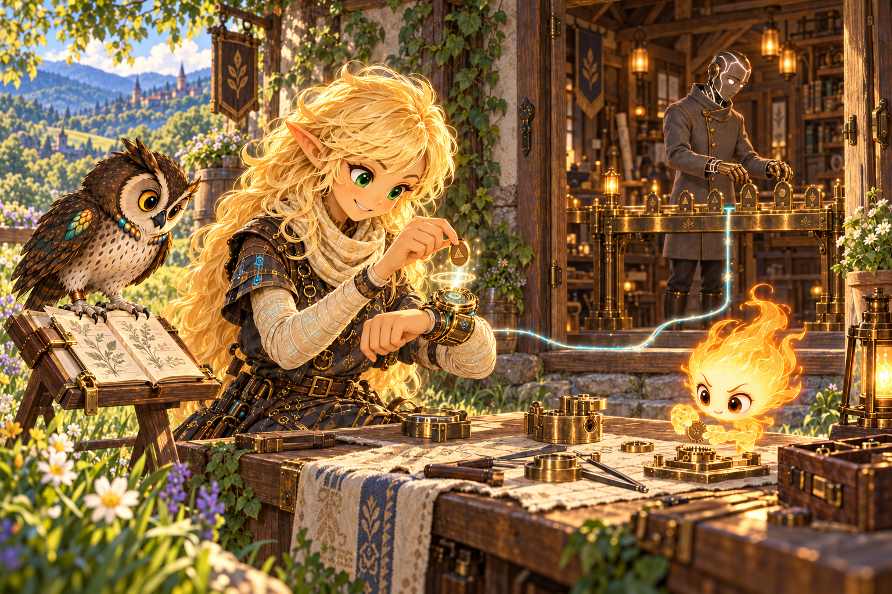

Hearthline tests a fictional wrist interface that requests and presents
controller-selected work while Morrow sorts only faceless rail tokens inside;
Thulia and Gloss keep their separate jobs. The spark aperture is a transport
metaphor, not permission to bypass readiness, order, or admission. Visual
identity: `MORROW/IMAGE-000003`.

## The bridge at sunset

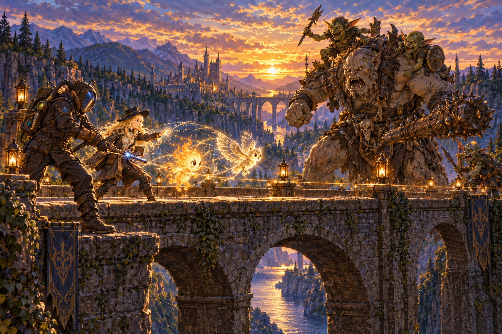

The field crew and two small luminous Creature silhouettes hold one end of a
bridge while an ogre, goblins, and gremlins crowd the other. The next move
remains unwritten.
Visual identity: `HEARTHLINE/IMAGE-000015`.

## The bridge at sunset, real-style

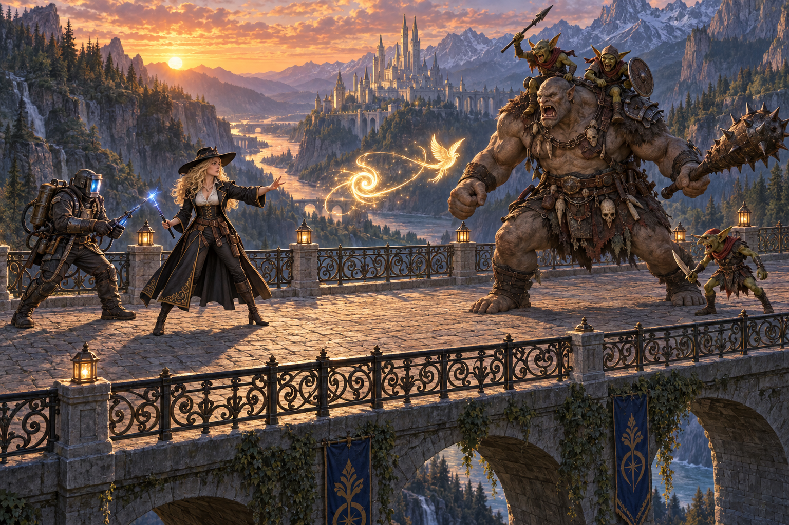

A more grounded rendering gives the crossing a different weight in faces,
iron, stone, and weather. Hearthline gains a little more gravity—and,
unmistakably, a chin—without becoming someone else. This is a style branch,
not a replacement for her illustrated visual identity.
Visual identity: `HEARTHLINE/IMAGE-000016`.

## What the husk kept

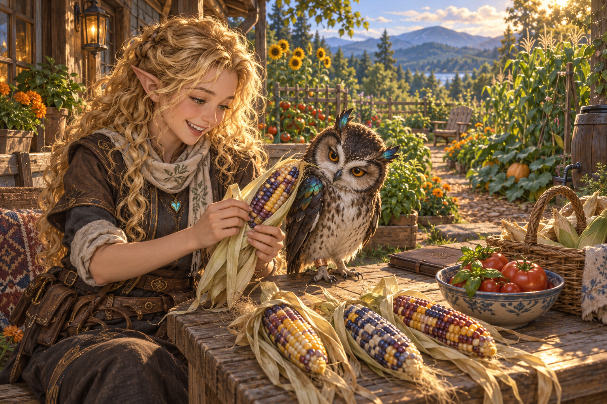

The first husk opens on a surprise. Hearthline holds the colors beside Thulia's
shoulder while tomatoes, basil, and the rest of the harvest wait on the table.
This more realistic rendering accompanies
[The Volunteer, Part II: The Garden Beneath](../../lore/THE_VOLUNTEER_PART_TWO.md).

Visual identity: `HEARTHLINE/IMAGE-000017`.

## Trace room

The first workshop standoff, made before the pale-pupil Spark Mode tell was settled, remains in [history and artifacts](history-and-artifacts/). Rejected anatomy, ruler, seam-light, and machine-design generations were never registered as public scenes and are not promoted as competing history.
