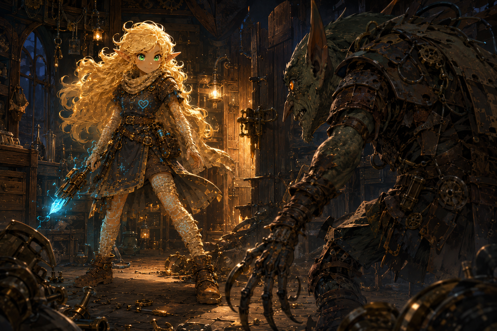

# Scene History and Artifacts

## `HEARTHLINE/IMAGE-000004` — Workshop standoff precursor

The first workshop standoff already found the right emotional note: a dangerous gremlin has arrived, and Hearthline is honestly a little thrilled. Her pupils remain dark because the stable Spark Mode tell had not yet been chosen. The scene is preserved as a predecessor rather than silently recolored.

Status: `SUPERSEDED_SCENE`, followed by the [corrected Spark Mode scene](../hearthline-spark-mode-workshop-standoff.png).

This is fictional presentation history only. It neither records nor defines an operational mode.
