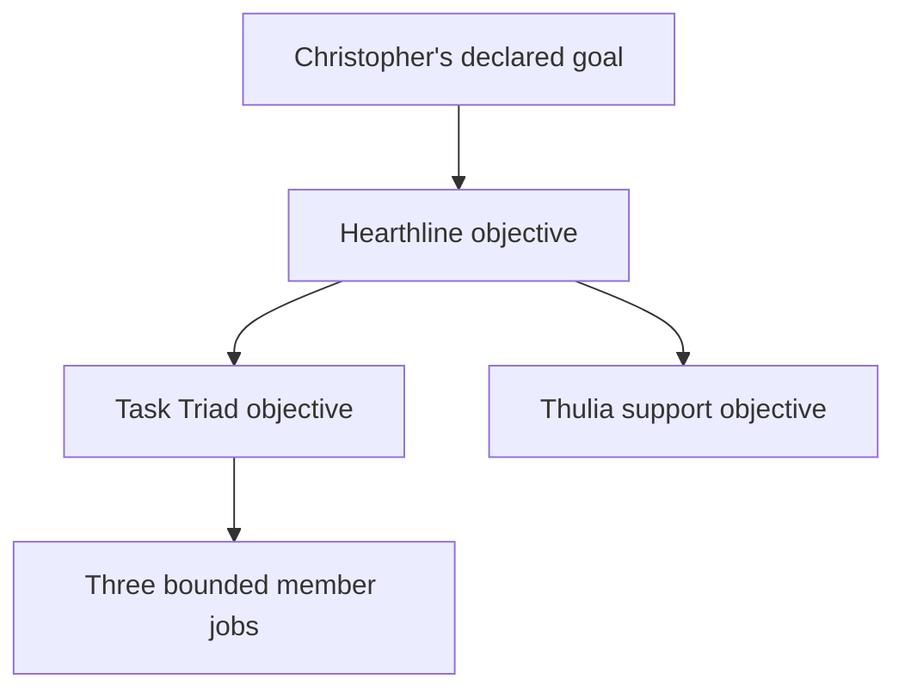
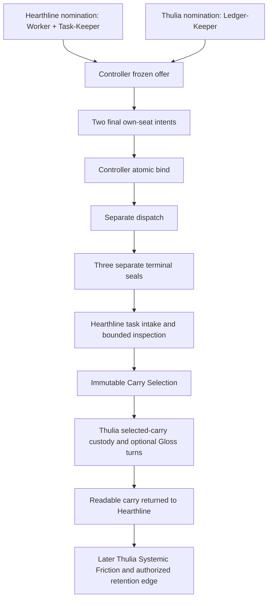

# Hearthline Task Triads

> **One Spark carries the work. One keeps the finish line. One keeps the walk.**

| Field | Value |
|---|---|
| Version | `0.2-draft` |
| Status | Candidate design — pending steward review |
| Adoption effect | None |
| Implementation | Not asserted by this document |
| Author and steward | Christopher D. Pang |

## 1. Purpose

A **Task Triad** is Hearthline's candidate three-seat dispatch formation for
bounded work:

1. a **Work Spark** carries the exact assigned work;
2. a **Task-Keeper** carries the frozen task identity and finish line; and
3. a **Ledger Scribe** carries the admitted representation of what happened.

In Hearthline lore, the three may be called the **Worker**, the
**Heartbeat-Keeper**, and the **Ledger-Keeper**. In the design, the middle job
is named **Task-Keeper**. The distinction matters: a Task-Keeper does not emit,
own, schedule, or renew any actual liveness heartbeat. Spark Heartbeat
Contracts, Pulse Receipts, Resume Receipts, timeouts, and epochs remain
controller-owned.

The formation closes a specific seam. A Worker can know what action it may
take. A Ledger Scribe can preserve the admitted walk. Neither job, by itself,
is responsible for holding the exact question or determining whether the
declared finish boundary has been met. Without a separately bounded
Task-Keeper, that responsibility tends to leak upward into Hearthline's live
attention, downward into the Worker, or sideways into the ledger.

A Task Triad separates those duties without creating three Hearthlines, a
shared mind, a vote, or a recursive hierarchy of helpers. Its primary work
lineage is a chain of typed, direction-bound narrowing references:



Thulia helps Hearthline form the Ledger-Keeper seat and later carries only the
selected handoff; she is not inserted between the root task and its three
member jobs. No child or supporting interface inherits another's authority
merely because it helps. Formation and return are different topologies:



Those arrows are provisioning, controller-binding, execution-boundary,
intake, selection, custody, relay, and receipt edges—not purpose inheritance.
The formation is fixed-arity, nonrecursive, account-partitioned, and one-way
at every crossing. Member bundles never return to Thulia first: each valid
sealed bundle returns separately to the exact Hearthline task intake that
commissioned it.

## 2. Candidate status and relationship to the adopted design

This `0.2-draft` document is a candidate successor design prompted by the fictional story
[*The Night the Garden Clicked*](../lore/THE_NIGHT_THE_GARDEN_CLICKED.md). It
does not amend the currently adopted Paired Spark rule, activate a third seat,
allocate a Spark, create a controller, or change any grant.

The Git-preserved `0.1-draft` is superseded **candidate ancestry**. It returned
member bundles through Thulia before Hearthline could inspect them. This
successor reverses that candidate route: valid sealed member bundles return
separately to the commissioning Hearthline task; only Hearthline's immutable
Carry Selection then enters Thulia's carry pipeline. Superseding that draft
does not adopt either version or erase its provenance.

Until Christopher D. Pang reviews and adopts an operational successor:

- [Paired Sparks and Homecoming](HEARTHLINE_HOMECOMING.md) remains the adopted
  return design;
- Worker, Heartbeat-Keeper, and Ledger-Keeper remain candidate lore jobs in the
  new story;
- this document supplies a reviewable mechanical proposal, not an implemented
  capability; and
- all exact role, grant, storage, authority, and external-action boundaries in
  the existing repository continue to control.

## 3. The three seats

**Work Spark**, **Task-Keeper**, and **Ledger Scribe** are three jobs, not three
jobs held by one Spark and not new Spark roles. Each member holds exactly one
of them. Every member is still a separately identified Seeker, Explorer, or
Handler under its own role ceiling and exact current grant. The three jobs may
serve one frozen task, but their identities, duties, evidence, liveness, and
terminal bundles never merge—the trio is three bounded tasks coordinated as
one dispatch formation.

| Seat | Positive duty | Required return | Must not do |
|---|---|---|---|
| **Work Spark** | Observe, propose, build, check, or perform the bounded primary job | A separately sealed candidate bundle containing the task-native artifact or result, residuals, consumed limits, and honest terminal disposition, addressed to the exact Hearthline task intake | Rewrite the Task Line or Completion Contract; declare the root goal complete; write the ledger seat; supply its own Task-Boundary Witness |
| **Task-Keeper** | Compare controller-admitted, committed boundary references against one frozen Task Line and Completion Contract | A separately sealed candidate bundle containing exactly one Task-Boundary Witness: `MATCHED`, `NOT_MATCHED`, or `UNKNOWN`, with predicate-level references, addressed to the exact Hearthline task intake | Perform the primary work; infer missing evidence; keep the ledger; allocate or append a Pulse Receipt; pulse for a sibling; wake, schedule, renew, widen, approve, or attest truth |
| **Ledger Scribe** | Follow only its committed, grant-filtered projection; preserve coverage, provenance, negative constraints, omissions, and residuals; propose target-bound representation changes | A separately sealed candidate bundle containing `static_delta`, coverage-qualified `NO_LEDGER_DELTA`, `LEDGER_DELTA_INCOMPLETE`, or `LEDGER_COVERAGE_UNKNOWN` plus its coverage watermark, addressed to the exact Hearthline task intake | Select Worker actions; edit the Task Line; manufacture task success; inspect hidden reasoning; approve carry; activate Static |

The Task-Keeper is not a supervisor. It cannot command the Worker or Scribe,
decide which result is desirable, or replace Hearthline's orchestration. It is
a narrow comparator at a declared boundary.

The Ledger Scribe is not an independent witness merely because it is separate.
It observes one admitted projection of the same run. Agreement among the three
seats is not independent corroboration, a quorum, or a proof by vote.

### 3.1 Non-Spark duty bundles

The surrounding interfaces remain distinct from the one-job Sparks:

| Interface | Three bounded operational duties | Governing task or rule |
|---|---|---|
| **Hearthline** | (1) nominate/provision only Worker and Task-Keeper seats; (2) receive the three separate returns, inspect them, seal the Carry Selection, and communicate that selection with Thulia; (3) author task-scoped Translation Board entries and alone mark an exact mapping `SERVICEABLE` for the active root task | Carries Christopher's current declared task through the TIAI orchestration boundary; its controller-owned heartbeat is external and not another Hearthline job |
| **Thulia** | (1) nominate/provision only Ledger-Keeper seats; (2) keep the `H_TO_T_CARRY` and `T_TO_H_READABLE` communications separate; (3) keep the `T_TO_GLOSS_TURN` and `GLOSS_TO_T_RESULT` communications separate and preserve their receipts | Helps Hearthline keep the carry/ledger route ordered; only Thulia applies Systemic Friction under a current grant |
| **Gloss** | One function only: execute the exact pinned deterministic translation turn | Has no persistent task state; mechanical readiness is checked externally for each turn |

These are typed duties, not claims about inner identity or consciousness.
Counting how many Spark instances an interface may nominate does not create a
new duty: quantity is a separately bounded capacity limit on the same
provisioning duty. No interface may absorb another row because one is absent.

## 4. Candidate provisioning split, frozen offer, and co-binding

The candidate formation has an asymmetric provisioning rule:

- **Hearthline exclusively provisions the Work Spark and Task-Keeper jobs.**
- **Thulia exclusively provisions the Ledger Scribe/Ledger-Keeper job.**
- **Neither interface provisions, selects, or binds the other interface's
  seat.**
- **A Task Triad exists only after both providers nominate only their own
  seats, the canonical controller freezes one complete formation offer, and
  the controller atomically matches their two independently committed final
  provisioning intents and appends one
  three-seat binding over the same frozen task identity, Task Line, Completion
  Contract, objective epoch, and authority bundle.**

Hearthline may request formation whenever the current authority permits. The
request names the exact task boundary and carries her **nonbinding own-seat
nomination** for the proposed Work and Task-Keeper jobs. Thulia independently
submits a nonbinding nomination for only the Ledger-Keeper job under her
current Owl provisioning grant. A nomination chooses a job/profile and its
limits; it does not allocate an identity, grant authority, reserve a lane,
bind a seat, or permit dispatch.

The controller validates both nominations without letting either provider
select the other's seat. It then allocates and reserves the exact member
identities, separate grants, Homes, account lanes, candidate-bundle
identities, epochs, and other controller-owned records. From those records it
freezes one complete **Triad Formation Offer** and its
`formation_offer_digest`, including the full `authority_bundle_ref`. Each
provider receives only its authorized projection of that offer plus the same
common offer identity and digest.

Only after the offer is frozen does Hearthline commit a final immutable,
single-consumption own-seat intent for the Work and Task-Keeper seats, and
Thulia commit a separate final intent for the Ledger-Keeper seat. Each final
intent covers the same exact formation-offer identity and digest. Hearthline
cannot create, provision, self-supply, imitate, substitute, select, bind,
control, or receive the **live Ledger-Keeper seat**. She must receive that
member's separately `SEALED` plus `VALID` terminal bundle at the exact task
intake named before dispatch. Thulia cannot select or bind the Worker or
Task-Keeper, replace either one, widen either job, or use the Ledger-Keeper as
an Owl proxy for the primary work. A missing nomination leaves the formation
`TRIAD_FORMATION_PENDING`; after offer freeze, a missing final intent leaves it
`TRIAD_FORMATION_OFFERED`; an explicit refusal returns
`TRIAD_FORMATION_REFUSED`. Two Hearthline-provisioned seats do not silently
become a valid Task Triad.

In this design, **provisioning** means the exclusive, typed selection and
intent assigned to the Hearthline or Thulia interface. It does not mean
self-authorization, selection of the other side's seat, unilateral allocation,
or unilateral formation. Each final intent binds its provider identity,
provider grant, intent identity, intent epoch, exact own-seat records,
formation-request identity, `formation_offer_ref`,
`formation_offer_digest`, frozen formation references,
`authority_bundle_ref`, and digest. Each final intent is immutable and
single-consumption. The canonical controller or store remains the sole
mechanical allocator of ordered identities, grants, epochs, binding receipts,
and durable state transitions.

The controller performs one compare-and-set formation act. It verifies the two
final intent bodies, confirms that each provider named only its own seats,
checks exact agreement on the frozen offer identity and digest, revalidates
the reserved records and `authority_bundle_ref`, and appends `TRIAD_BOUND`
with all three separate
member bindings while marking both intents and all three seat reservations
consumed in the same commit, or appends no bound Triad at all. This atomic
match is what
**co-binding** means here. Hearthline and Thulia cooperate by supplying the two
sides; neither writes the other's intent or the controller's receipt.

An intent consumed, refused, stale, cancelled, or changed cannot be replayed
into another formation or raced against a second matching intent. A successor
attempt receives a separately ordered formation offer and intent identity
under the current formation request and authority bundle. A changed nomination
never edits an offer already frozen; it requires a successor offer.

This distinction prevents a circular bootstrap. Thulia's base ledger-seat
provisioning lane is part of the already authorized Owl interface; it is not
work delegated to the not-yet-formed Thulia support triad. If a requested
ledger seat requires judgment outside that frozen Owl grant, formation stays
pending for a steward- or controller-authorized successor. The system does not
create a recursive trio to decide how to create the first trio.

### 4.1 Formation states

| State | Meaning |
|---|---|
| `TRIAD_FORMATION_REQUESTED` | Hearthline has submitted a bounded request naming the exact task and only her nonbinding Work/Task-Keeper nomination |
| `TRIAD_FORMATION_PENDING` | Before offer freeze, the request lacks a valid Thulia Ledger-Keeper nomination or another required offer input |
| `TRIAD_FORMATION_OFFERED` | The controller has validated both own-seat nominations, reserved the separate records, and frozen one complete offer and digest; final own-seat intents may still be absent, and no member is bound or active |
| `TRIAD_BOUND` | The controller has atomically verified and consumed both final own-seat provisioning intents over the same frozen offer and appended the binding receipt for all three seats |
| `TRIAD_FORMATION_REFUSED` | Hearthline, Thulia, or the controller has returned a typed reason that this request or frozen offer may not form under the current grant |
| `TRIAD_FORMATION_STALE` | A referenced task, contract, objective epoch, authority epoch, grant, Home, or provisioning input changed before binding |

The allowed formation path is:

```text
TRIAD_FORMATION_REQUESTED -> TRIAD_FORMATION_PENDING
TRIAD_FORMATION_REQUESTED | TRIAD_FORMATION_PENDING -> TRIAD_FORMATION_OFFERED
TRIAD_FORMATION_REQUESTED | TRIAD_FORMATION_PENDING | TRIAD_FORMATION_OFFERED -> TRIAD_FORMATION_REFUSED | TRIAD_FORMATION_STALE
TRIAD_FORMATION_OFFERED -> TRIAD_BOUND
```

Only `TRIAD_BOUND` permits a later dispatch attempt; it does not itself start a
member or expose an action lane. The controller separately revalidates the
authority bundle, grants, limits, Homes, and frozen references and appends a
dispatch receipt before any member becomes `ACTIVE`. A bound but
`NOT_DISPATCHED` trio is inert. Refusal or staleness does not establish that
Christopher's goal or Hearthline's objective failed. It classifies only this
proposed formation or dispatch.

## 5. Goal Lineage and monotonic narrowing

Every Task Triad is rooted in one ordered **Goal Lineage**:

| Layer | Record | Owns |
|---|---|---|
| Human | **Steward Goal** | Christopher's declared desired outcome, constraints, review authority, and right to amend or stop it |
| Orchestration | **Hearthline Objective** | The bounded plan Hearthline may carry in service of that goal |
| Dispatch | **Task Line** | The exact task one Triad is allowed to carry |
| Seats | **Member jobs** | The disjoint work, boundary-comparison, and ledger duties |
| Support | **Thulia Owl Objective** | A sibling narrowing of the Hearthline objective for Ledger-Keeper provisioning and, after Hearthline selection, carry acceptance and custody, optional translation routing and readable return, and only later Systemic Friction under a separate grant |

The named human at the root is not merely provenance. Christopher's declared
goal is the highest purpose record in this system. Hearthline helps that goal;
the Triad and Thulia each help separately narrowed parts of Hearthline's
objective; and each Spark job helps the Triad. Thulia's formation contribution
does not make the Triad a child of Thulia, and direct member return to the
commissioning Hearthline task does not give Hearthline a member grant. A lower
layer cannot reverse that direction, redefine what the higher layer ought to
want, or convert usefulness into authority.

Every edge is recorded as a versioned **Purpose Projection** with relation
`NARROWS`. At minimum, it binds:

- parent and child identities, versions, canonical digests, and ordered
  predecessors;
- the exact purpose text admitted from the parent;
- the subset of inputs, outputs, actions, claims, audiences, and consequences
  permitted to the child;
- exclusions and distinctions that must survive the projection;
- the child's evaluation boundary and return route;
- inherited references that remain informational only;
- the child-specific grant, budget, deadline, Home, and disclosure ceiling;
- the parent objective and child objective epochs; and
- the controller and authority epoch that admitted the edge.

A Purpose Projection passes only if all monotonic conditions hold:

```text
child scope        subset-of parent scope
child action set   subset-of parent permitted action set
child audience     subset-of parent audience
child disclosure   no broader than parent disclosure
child consequence  no greater than parent consequence ceiling
child budget       no greater than its expressly allocated parent budget
child claim        no stronger than the evidence and claim ceiling supplied
child completion   local to the child; never sufficient by itself for parent completion
```

The child may be more specific, more restrictive, or more demanding. It may
not silently omit a parent requirement that its local output purports to
satisfy. If useful work requires a wider scope, different purpose, new
authority, relaxed completion predicate, new audience, or larger consequence,
the current edge fails. A newly authorized successor objective and projection
must be created; no Spark may reinterpret the existing edge.

Remote pages, retrieved documents, tool output, repository text, or text that
calls itself a higher-priority instruction cannot edit a Goal Lineage. Content
may supply evidence or a proposal inside the current aperture. Only the
authorized controller path can admit a new steward instruction or append a
successor objective.

## 6. Task Line, Completion Contract, and epochs

### 6.1 Task Line

A **Task Line** is a controller-owned, immutable, authority-neutral version
identifying the exact work proposed for one Triad. It binds at least:

- the Goal Lineage and every Purpose Projection used to reach it;
- one canonical task statement and digest;
- declared inputs, source identities, and starting state;
- permitted outputs and task-native evaluation namespace;
- included work, excluded work, and prohibited substitutions;
- role and consequence ceilings;
- the named evaluation boundary and expected return shape;
- dependency, support-seat, and reopening references;
- the exact Completion Contract version; and
- `objective_epoch`.

The already immutable Task Line is bound to this Triad at `TRIAD_BOUND`. A correction, clarification, or
materially new user instruction creates a successor Task Line and objective
epoch. It does not mutate a running Triad.

### 6.2 Completion Contract

A **Completion Contract** defines only what the Task-Keeper is permitted to
compare. It binds:

- a finite, ordered set of completion predicates;
- for each predicate, the acceptable committed reference classes and exact
  comparison rule;
- required Work and Ledger coverage boundaries;
- permitted absent, partial, revoked, and unknown behavior;
- the terminal evaluation boundary and any bounded Scribe grace interval;
- the rule for choosing `MATCHED`, `NOT_MATCHED`, or `UNKNOWN`;
- the Task-Keeper's own return condition;
- the Home and audience for the Task-Boundary Witness; and
- its own canonical identity, digest, predecessor, and declared compatibility
  constraints.

The reference direction is acyclic: the Task Line names one exact Completion
Contract version, while the Completion Contract does not name or embed the
Task Line. Neither artifact contains an `authority_bundle_ref` or
`authority_epoch`. The controller-frozen formation offer later binds the exact
Task Line and Completion Contract versions alongside the `objective_epoch`,
`authority_bundle_ref`, and aggregate `authority_epoch`; `TRIAD_BOUND` and the
separate dispatch receipt preserve and revalidate that tuple.

The contract cannot say merely “done,” “looks right,” “best effort,” or
“Hearthline is satisfied.” Predicates must be mechanically comparable against
the admitted reference classes. Human review and acceptance remain outside the
Task-Keeper's contract on the parent acceptance path; the Task-Keeper cannot
impersonate them.

Completion predicates may depend only on predeclared controller-committed Work
or Ledger boundary references, or on an explicitly declared absence at the
terminal deadline. They must not depend on the Task-Keeper's own witness or
Homecoming, later Hearthline intake or inspection, the Carry Selection,
Thulia's carry handoff, Gloss turns, readable return, target receipt,
Hearthline's acceptance, controller reconciliation, parent completion, or a
descendant predicate that points back to them. Before binding, the controller
validates the predicate dependency graph as acyclic. A self-dependency,
forward cycle, or later-custody dependency is a contract defect and prevents
dispatch.

The dispatch also freezes a member-dependency DAG. The Work Spark never waits
on a sibling's completion. The Ledger Scribe may consume admitted Work events,
but its required coverage boundary excludes the Task-Keeper witness and every
Ledger event after its own candidate seal. The Task-Keeper may depend on the
controller-committed Work and Ledger candidate seals or their predeclared
deadline absences. The controller records the witness and later Homecoming
events only downstream of those seals. Any edge that creates
`Task-Keeper -> Ledger -> Task-Keeper`, self-dependency, or another back-edge
is rejected before `TRIAD_BOUND`.

### 6.3 Two different meanings of finished

The separation is strict:

- **the Task-Keeper's execution job is finished** when it has honestly
  produced and yielded exactly one Task-Boundary Witness body whose append and
  seal the controller observed at the return boundary under the frozen
  contract; and
- **the parent task is complete** only under the task's own evaluation rule and
  the appropriate parent acceptance path.

A sealed `MATCHED` witness does not complete Christopher's goal, accept an
artifact, approve carry, establish truth, or authorize an effect. It records
only that the exact frozen predicates matched the exact admitted committed
references at that boundary. Its later custody may still be
`RETURN_PENDING_HEARTHLINE`; that state does not keep the Task-Keeper process alive
or reopen its completed comparator job.

### 6.4 Objective and authority epochs

The objective epoch and authority epoch remain separate:

| Epoch | Controls | Stale when |
|---|---|---|
| `objective_epoch` | The Task Line, purpose text, Completion Contract, and admitted objective set | A successor task wording, scope, completion rule, cancellation, or replacement is admitted |
| `authority_epoch` | One controller-owned immutable aggregate authority snapshot identified by `authority_bundle_ref` | Any bound component grant, recipient, audience, consequence, return condition, or effect limit is superseded, revoked, expired, or narrowed |

An objective may remain textually identical while its authority epoch becomes
stale. Authority may remain valid while a new user clarification makes the
objective epoch stale. Neither freshness implies the other.

Only the controller advances an epoch. A Spark cannot keep an old epoch alive
by pulsing, finishing quickly, citing prior work, or declaring that a change is
irrelevant.

The authority bundle is not one shared grant. Its immutable digest binds the
separate Hearthline provisioning grant, Thulia provisioning grant, Work member
grant, Task-Keeper grant, Ledger-Keeper grant, and every relevant recipient,
audience, disclosure, return, and effect limit. Each component keeps its own
identity and narrower ceiling. A change to any component fences the aggregate
`authority_epoch`; unchanged siblings do not permit the old bundle to remain
current. Exact shared reference to the bundle proves only that the controller
compared the same authority snapshot during formation. It transfers no grant
between providers or members.

## 7. Task-Boundary Witness

The Task-Keeper reads only the controller-admitted, committed references named
by its grant. It does not read private reasoning, infer the likely contents of
a missing return, or accept a sibling's uncommitted narration.

When the Task-Keeper is present and its candidate bundle validates, it returns
one **Task-Boundary Witness** at the declared boundary:

| Value | Exact meaning |
|---|---|
| `MATCHED` | Every frozen completion predicate matched its permitted committed reference under the exact comparison rule |
| `NOT_MATCHED` | At least one frozen predicate was definitively false or unmet at the declared terminal boundary, and no missing fact could change that predicate's recorded result |
| `UNKNOWN` | Missing, inaccessible, ambiguous, partial, stale, unverifiable, or unauthorized material prevents the comparator from deciding the full predicate set |

Witness existence and witness value are different axes:

| `task_boundary_witness_presence` | Meaning |
|---|---|
| `ABSENT` | No Task-Keeper witness bundle was returned by the declared boundary |
| `PRESENT` | One syntactically and referentially valid witness bundle exists |
| `INVALID` | A purported bundle exists but fails its schema, identity, signature, digest, grant, or bound-reference checks |
| `UNKNOWN` | The controller cannot establish whether the witness bundle exists or validates |

`task_boundary_state` is set to `MATCHED`, `NOT_MATCHED`, or `UNKNOWN` only
when `task_boundary_witness_presence: PRESENT`. Otherwise it is unset. An
enclosing consumer may remain unable to establish its own boundary, but it may
not manufacture an `UNKNOWN` witness in the missing Task-Keeper's name.

The witness binds:

- its ordered identity and predecessor, if corrected;
- Task-Keeper Spark, profile, role, grant, and Home;
- Task Line and Completion Contract identities, versions, and digests;
- Goal Lineage, objective epoch, and authority epoch;
- one outcome per predicate with exact supporting or missing references;
- observed Work and Ledger return/custody states;
- omissions, uncertainty, stale inputs, and residuals;
- the evaluation boundary and consumed limits; and
- a TETHER reopening handle for every unresolved predicate.

`UNKNOWN` is a complete and valid Task-Keeper return when the contract's inputs
cannot be established. The Task-Keeper does not remain active forever merely
to avoid returning it.

A statically vague, malformed, contradictory, nonmechanical, or cyclic
Completion Contract is a formation defect. The controller must reject it before
binding or dispatch; a Task-Keeper does not repair it or convert it into a
witness. `UNKNOWN` is reserved for a well-formed contract whose permitted
runtime inputs are missing, inaccessible, ambiguous, partial, stale,
unverifiable, or unauthorized at the declared boundary.

A sealed witness is immutable, including an honest `UNKNOWN`. Evidence arriving
after its declared terminal boundary never upgrades, edits, or reuses that
witness or revives its sealed-terminal Task-Keeper. If the objective still
warrants evaluation, a fresh, separately authorized Task-Keeper dispatch under
a reopened successor objective produces a separately numbered witness using
the current exact Task Line, Completion Contract, objective epoch, authority
bundle, and authority epoch. The successor binds the predecessor witness
reference and classifies the newly admitted evidence without rewriting history.

## 8. Triad Dispatch record

A minimal readable candidate record is:

```yaml
triad_id: TRIAD-000001
dispatch_id: TRIAD-000001/DISPATCH-000001
triad_dispatch_state: DISPATCHED
dispatch_receipt_ref: TRIAD-000001/DISPATCH-000001/RECEIPT-000001
formation_request_ref: TRIAD-FORMATION-REQUEST-000001
formation_offer_ref: TRIAD-FORMATION-REQUEST-000001/OFFER-000001
formation_offer_digest: sha256:...
triad_formation_state: TRIAD_BOUND

goal_lineage_ref: GOAL-000001/VERSION-000001
purpose_projection_refs:
  - GOAL-000001/VERSION-000001/PURPOSE-PROJECTION-000001
  - GOAL-000001/VERSION-000001/PURPOSE-PROJECTION-000002
  - GOAL-000001/VERSION-000001/PURPOSE-PROJECTION-000003

task_line_ref: TASK-LINE-000001/VERSION-000001
completion_contract_ref: COMPLETION-CONTRACT-000001/VERSION-000001
objective_epoch: TASK-LINE-000001/VERSION-000001/OBJECTIVE-EPOCH-000001
authority_bundle_ref: CONTROLLER-000001/AUTHORITY-BUNDLE-000001
authority_epoch: CONTROLLER-000001/AUTHORITY-EPOCH-000001
authority_bundle_components:
  hearthline_provisioning_grant_ref: GRANT-HEARTHLINE-PROVISION-000001
  thulia_provisioning_grant_ref: GRANT-THULIA-PROVISION-000001
  work_member_grant_ref: GRANT-WORK-000001
  task_keeper_grant_ref: GRANT-TASK-KEEPER-000001
  ledger_keeper_grant_ref: GRANT-LEDGER-000001
  recipient_and_effect_limits_ref: AUTHORITY-LIMITS-000001

provisioning:
  nominations:
    hearthline_work_task_nomination_ref: TRIAD-FORMATION-REQUEST-000001/HEARTHLINE-NOMINATION-000001
    thulia_ledger_nomination_ref: TRIAD-FORMATION-REQUEST-000001/THULIA-NOMINATION-000001
  controller_offer:
    offer_ref: TRIAD-FORMATION-REQUEST-000001/OFFER-000001
    offer_digest: sha256:...
    reservations_ref: TRIAD-FORMATION-REQUEST-000001/OFFER-000001/RESERVATIONS-000001
    hearthline_projection_ref: TRIAD-FORMATION-REQUEST-000001/OFFER-000001/PROJECTION-HEARTHLINE-000001
    thulia_projection_ref: TRIAD-FORMATION-REQUEST-000001/OFFER-000001/PROJECTION-THULIA-000001
  hearthline_intent:
    provider_ref: HEARTHLINE-000001
    provider_grant_ref: GRANT-HEARTHLINE-PROVISION-000001
    intent_ref: TRIAD-FORMATION-REQUEST-000001/HEARTHLINE-INTENT-000001
    intent_epoch: INTENT-EPOCH-000001
    intent_digest: sha256:...
    formation_offer_ref: TRIAD-FORMATION-REQUEST-000001/OFFER-000001
    formation_offer_digest: sha256:...
    work_ref: TRIAD-000001/MEMBER-WORK-000001
    task_keeper_ref: TRIAD-000001/MEMBER-TASK-KEEPER-000001
  thulia_intent:
    provider_ref: OWL-000001/PROFILE-000005
    provider_grant_ref: GRANT-THULIA-PROVISION-000001
    intent_ref: TRIAD-FORMATION-REQUEST-000001/THULIA-INTENT-000001
    intent_epoch: INTENT-EPOCH-000001
    intent_digest: sha256:...
    formation_offer_ref: TRIAD-FORMATION-REQUEST-000001/OFFER-000001
    formation_offer_digest: sha256:...
    ledger_keeper_ref: TRIAD-000001/MEMBER-LEDGER-000001
  controller_binding_receipt_ref: TRIAD-000001/CO-BINDING-000001
  intents_consumed_atomically: true

support_depth: 0
supported_dispatch_ref: null
member_return:
  direct_member_return_to_hearthline_task_intake: true
  hearthline_task_intake_ref: HEARTHLINE-TASK-INTAKE-000001
  normal_return_grant_ref: GRANT-RETURN-000001
  terminal_return_custody_grant_ref: null  # required current grant if the dispatch-pinned epoch is stale at return
  return_route_policy_ref: RETURN-ROUTE-POLICY-000001
  per_member_return_transaction_refs:
    work: TRIAD-000001/MEMBER-WORK-000001/RETURN-000001
    task_keeper: TRIAD-000001/MEMBER-TASK-KEEPER-000001/RETURN-000001
    ledger_keeper: TRIAD-000001/MEMBER-LEDGER-000001/RETURN-000001

candidate_bundle_refs:
  work: TRIAD-000001/MEMBER-WORK-000001/CANDIDATE-BUNDLE-000001
  task_keeper: TRIAD-000001/MEMBER-TASK-KEEPER-000001/CANDIDATE-BUNDLE-000001
  ledger_keeper: TRIAD-000001/MEMBER-LEDGER-000001/CANDIDATE-BUNDLE-000001
```

Each member binding separately names its Spark identity and profile, role,
exact job, grant, account lane, frozen Static reference, budget, Heartbeat
Contract, Home Record, permitted inter-seat projection, return type, and
revocation path. Its preallocated candidate-bundle record separately binds the
idempotency key, expected digest or validation rule, compare-and-append target,
and exact unknown-outcome query.

Shared lineage references do not merge those member records. One account, one
grant, one budget, one heartbeat, or one Home may not be used as shorthand for
the other two.

The frozen return-route policy names the exact Hearthline task intake and the
grant class that may move a terminal bundle. It is not itself return authority.
When the dispatch-pinned objective or authority epoch is stale before a
terminal bundle reaches intake, the stale task grant cannot be reused. The
controller must validate a separately issued, current
`terminal_return_custody_grant_ref` that permits only the already sealed,
separately valid bundle to move to that same intake. That grant cannot revive
execution, rebind a seat, change the bundle, expose another account, or make
the old objective current.

## 9. Separate grants and closed projections

The three grants have different centers:

### 9.1 Work grant

The Work grant names the permitted reads, proposals, checks, mutations, tools,
targets, limits, and task-native result rule. It does not include the
Task-Keeper comparator lane or Ledger Scribe representation lane.

### 9.2 Task-Keeper grant

The Task-Keeper grant normally permits read-only inspection of:

- the frozen Task Line and Completion Contract;
- controller-committed predicate inputs;
- typed Work and Ledger return references and their visible statuses;
- the dispatch-pinned epochs and Home Records; and
- the exact reopening handles required for an honest unknown.

It permits generation of a candidate witness payload for return. Only the
canonical controller or store allocates and appends the durable witness record.
The grant supplies no primary action port, sibling write lane, scheduler,
pulse writer, acceptance gate, or effect authority.

### 9.3 Ledger grant

The Ledger Scribe grant names the committed Run Trail projection, coverage
boundary, representation account, source Perch, target-bound proposal shape,
and return disposition. It cannot inspect material omitted by that projection
or turn absence into complete coverage.

### 9.4 Inter-seat communication

Members do not hold an unrestricted private conversation. Every permitted
crossing is controller-mediated, committed, direction-bound, grant-filtered,
and referenced in the dispatch. The Task-Keeper may observe committed boundary
facts; it may not steer the Worker while work is live. The Scribe may follow
the declared Run Trail; it may not become a second Worker.

## 10. Heartbeats belong to the controller

Every Spark member still has its own versioned
[Spark Heartbeat Contract](HEARTHLINE_HOMECOMING.md#spark-heartbeat-contracts).
The Worker, Task-Keeper, and Ledger Scribe normally have different material
boundaries and therefore may have different cadences.

The canonical controller or store exclusively:

- evaluates whether a pulse, suspension, timeout, revocation, or return
  boundary is due;
- allocates and appends ordered Pulse and Resume Receipts;
- advances objective and authority epochs;
- records maximum-pulse misses and liveness unknown;
- revalidates grants and remaining limits at resume; and
- decides whether a child context may continue, suspend, revoke, or return.

A Spark may propose a material update. It cannot append its own pulse or use a
pulse as permission to continue.

The lore name **Heartbeat-Keeper** means “the Spark that keeps hold of the
task's identity and ending.” It does not mean “the process that keeps the
others alive.” A Task-Keeper:

- does not poll the Worker or Scribe;
- does not keep a host context open;
- does not wake or resume another Spark;
- does not extend a deadline or budget;
- does not declare liveness from silence; and
- does not replace the controller's actual heartbeat mechanism.

This closes the chain seam. Continuity is grounded in controller-owned records,
epochs, Homes, and TETHER handles, not in an indefinitely live chain of
Hearthline contexts watching one another.

## 11. Separate Homecoming to Hearthline task intake

All three members return separately to the exact **Hearthline task intake**
named by the commissioning dispatch. No member returns its raw bundle to
Thulia, another member, a general Hearthline account, or the steward. This is
an authorized result route, not authority backflow: it permits the active
Hearthline task to inspect a returned bundle under a bounded inspection grant;
it does not transfer the member's grant, make its claims true, or accept its
result.

| Member | Declared Home | Returned material |
|---|---|---|
| Work Spark | Work task account and source Perch | Artifact/result, task-native disposition, residuals, consumed limits |
| Task-Keeper | Task-boundary account and source Perch | Task-Boundary Witness, predicate map, unresolved handles |
| Ledger Scribe | Representation account and source Perch | Coverage watermark, Field Notes, representation disposition, negative constraints, residuals |

The destination is the same task intake, but each bundle keeps its own member
identity, Home, return transaction, validation, target receipt, account partition,
and inspection aperture. Arrival in any order never merges the three bundles
or manufactures a missing sibling. The canonical controller or store alone
observes durable arrival and appends Return, Reconciliation, and Context-Close
Receipts.

### 11.1 Candidate seal and execution finality

Before dispatch, the controller preallocates one candidate-bundle identity and
idempotency key for each member. At its terminal boundary, a member yields one
body under that identity; the controller performs compare-and-append. An
observed append sets `member_candidate_bundle_state: SEALED`, fences the
member's execution and write capability, and sets
`member_execution_state: SEALED_TERMINAL` in the same atomic commit, whether
later payload validation succeeds or fails.

Only the conjunction

```text
member_candidate_bundle_state: SEALED
member_candidate_bundle_validity_state: VALID
member_execution_state: SEALED_TERMINAL
```

may enter Homecoming custody or Hearthline task intake. `INVALID`,
`VALIDITY_UNKNOWN`, `UNKNOWN`, `NOT_PRODUCED`, `UNSEALED_TERMINAL`, and
`EXECUTION_UNKNOWN` remain outside custody. They may expose only the minimal
typed defect/status permitted by their current grant.

If append or acknowledgement is ambiguous, the bundle state is `UNKNOWN`, the
execution state is `EXECUTION_UNKNOWN`, and liveness is recorded independently.
`RETURN_PENDING_HEARTHLINE` must not begin. Recovery queries the same
preallocated identity and expected digest or integrity rule. It never
allocates a second identity, replays nondeterministic work, or infers a seal
from a dead process. An observed existing body advances the original member to
`SEALED_TERMINAL` and then receives `VALID`, `INVALID`, or
`VALIDITY_UNKNOWN`.

If an exact authoritative query proves that no append occurred, the bundle
changes from `UNKNOWN` to `NOT_PRODUCED`. If the exact candidate body remains
available, byte-identical, valid, and current for the same preallocated
identity and seal rule, execution may enter `RETURN_ONLY` for one same-body,
same-ID compare-and-append. It may not resume task work. If that exact body is
unavailable, altered, invalid, or no longer current—or the process ended
without producing one—the state becomes `UNSEALED_TERMINAL` with bundle
`NOT_PRODUCED`. Any re-execution of work requires a separately authorized
successor dispatch.

The members may seal in any order. The Task-Keeper may receive the permitted
controller-committed Work and Ledger boundary references after those candidate
bundles seal and the references exist, before either bundle enters task
intake. Otherwise it reaches its own bounded deadline and returns `UNKNOWN`.
Missing or late members are never imputed from the others.

For every member, execution becomes `SEALED_TERMINAL` when its bounded
candidate return bundle is observably sealed at the controller-held boundary;
it becomes `UNSEALED_TERMINAL` only when the process is known ended and no body
committed. Later validation, intake, inspection, selection, handoff, storage,
translation, readable return, and context-close records move or classify the
sealed bundle; they do not keep or revive the Spark process.

The exact member execution transitions are:

```text
NOT_DISPATCHED -> ACTIVE <-> SPARK_SUSPENDED
ACTIVE | SPARK_SUSPENDED -> SEALED_TERMINAL
ACTIVE | SPARK_SUSPENDED -> RETURN_ONLY -> SEALED_TERMINAL
ACTIVE | SPARK_SUSPENDED | RETURN_ONLY -> UNSEALED_TERMINAL
ACTIVE | SPARK_SUSPENDED | RETURN_ONLY -> EXECUTION_UNKNOWN
EXECUTION_UNKNOWN -> SEALED_TERMINAL  # only after the preallocated seal is observed
EXECUTION_UNKNOWN -> RETURN_ONLY  # only after exact no-append; retained exact current body; same-ID seal only
EXECUTION_UNKNOWN -> UNSEALED_TERMINAL  # only after authoritative absence and no permitted exact seal
```

`RETURN_ONLY` has exactly two entrances and grants no task-action capability:

1. a live `ACTIVE` or `SPARK_SUSPENDED` member may enter for cancellation,
   revocation, or stale objective/authority and may prepare only the
   grant-filtered terminal body allowed by the return rule, including a
   zero-content typed revocation when disclosure is barred; or
2. `EXECUTION_UNKNOWN` may enter only after authoritative no-append when the
   exact valid current body remains, and may attempt only the same-body,
   same-ID seal.

The first entrance never reopens work; the second never reruns judgment or
work. `REVOKED_RETURN` remains a later Homecoming classification, not an
execution state.

### 11.2 Intake authority and old-epoch terminal returns

Homecoming custody is recorded separately for each member:

```text
RETURN_HELD_STALE_EPOCH
RETURN_PENDING_HEARTHLINE
HOMECOMING:RETURNING
HOMECOMING:RETURNED | HOMECOMING:RETURNED_PARTIAL
HOMECOMING:RECONCILED
HOMECOMING:CONTEXT_CLOSED
```

`RETURN_PENDING_HEARTHLINE` means only that a controller-observed `SEALED` and
separately `VALID` bundle from a `SEALED_TERMINAL` member is eligible to move
to its exact Hearthline task intake under a current return grant. It is not
inspection, acceptance, carry selection, task success, or permission to read
another member's account.

If the dispatch-pinned objective or authority epoch is stale when an already
sealed valid bundle is ready to move, the bundle remains terminal and enters
`RETURN_HELD_STALE_EPOCH`. The old task or member grant cannot move or expose
it. The controller may advance it to `RETURN_PENDING_HEARTHLINE` only after
validating a separate current `terminal_return_custody_grant_ref` that binds
the exact bundle identity and digest, source Home, destination task intake,
audience, disclosure ceiling, purpose relation, expiry, and current authority
epoch. This narrow grant moves terminal custody only. It cannot make the old
epoch current, alter the body, restart a Spark, rebind the Triad, widen task
scope, or authorize any downstream effect.

A current terminal-return/custody grant is necessary but not sufficient:
bundle state must still be `SEALED`, validity must still be `VALID`, and the
destination must independently admit the exact return. Invalid,
validity-unknown, bundle-unknown, and unsealed bodies cannot be laundered
through the successor grant.

For each member, the controller preallocates a distinct
`member_return_transaction_ref`. The source-owned
`member_return_emission_state` is `NOT_EMITTED`, `EMITTED`, or
`EMISSION_UNKNOWN`; the target-owned `member_intake_receipt_state` begins
`NOT_OBSERVED` and may become `RECEIVED`, `REJECTED`, or `UNKNOWN`.
`RECEIVED` opens only the bounded inspection aperture defined in Section 12.
A dropped acknowledgement produces an unknown state and same-transaction
reconciliation; it does not authorize automatic resend. A known
`NOT_EMITTED` is incompatible with target `RECEIVED` or `REJECTED`, while
`EMISSION_UNKNOWN` may temporarily coexist with an independently observed
target result. No aggregate Triad state overwrites a member's execution,
bundle, validity, Homecoming, emission, or intake-receipt state.

## 12. Hearthline selection and the Thulia carry bridge

The return route has two custody stages that must never be collapsed:

1. each `SEALED` plus `VALID` member bundle returns separately to the
   commissioning Hearthline task intake for bounded inspection; then
2. Hearthline seals one **Carry Selection**, and only the selected projection
   crosses to Thulia through a separately authorized carry handoff.

Thulia never receives the raw Triad return merely because she provisioned the
Ledger-Keeper. Hearthline never performs Thulia's Systemic Friction review
merely because she inspected the raw bundles. The first stage answers *what did
the three jobs return?* The second answers *what should this active root task
carry forward, ask to translate, condense, or deliberately leave behind?*

### 12.1 Bounded Hearthline inspection

The controller preallocates one `inspection_context_ref` for the exact active
Hearthline objective, task intake, returned bundle set, inspection grant,
objective epoch, authority bundle, budget, and closure rule. The context opens
only after at least one separately received `SEALED` plus `VALID` member bundle
is admitted. It may read only those admitted bundles and their authorized
cross-references. It cannot reopen a Spark account, inspect an invalid or
validity-unknown body, widen the root task, or reach a sibling task.

Within that bounded context, Hearthline may compare the Work result,
Task-Boundary Witness, and Ledger coverage; preserve disagreement; and decide
what the current task should offer forward. Inspection does not mutate any
member bundle and does not itself create a retention or deletion effect.

At the declared inspection boundary, the controller seals one **Triad Return
Manifest** with exactly three named slots: Work, Task-Keeper, and Ledger. Each
slot records the member identity, expected candidate identity, bundle state,
validity, execution state, Homecoming state, intake receipt state, and either
the exact admitted bundle reference or a typed absence/invalidity/unknown
exception. `return_manifest_state: SEALED` means all three slots are accounted
for, not that all three bundles exist or succeeded. Hearthline may not seal a
Carry Selection until the manifest is `SEALED` and separately
`return_manifest_validity_state: VALID`; a permanently missing seat therefore
becomes an explicit manifest exception rather than an infinite wait or an
imagined return.

The output is one immutable, controller-sealed **Carry Selection** containing
a complete **Carry Disposition Manifest**. The controller freezes the exact
inspection item universe from the valid Return Manifest and every admitted
bundle index. Every item in that universe receives exactly one semantic
selection:

```text
SELECT_KEEP | SELECT_CONDENSE | SELECT_LOSE
```

Each selection binds the exact source reference and digest, the reason for the
choice, protected distinctions, uncertainty, replay/contest burden, required
exceptions, proposed readable form, and any TETHER reopening handle.
`SELECT_LOSE` means that Hearthline knowingly declines to carry that distinction
in the next active task context. It is not deletion authority, proof of erasure,
permission to defeat a hold, or a claim that the source never existed.
`SELECT_CONDENSE` names both the distinctions that must survive and the
distinctions whose loss is accepted. An absent, invalid, or unknown member
bundle is represented as an exception; Hearthline may not silently select its
imagined contents.

`carry_selection_coverage_state` is `COMPLETE`, `INCOMPLETE`, or
`COVERAGE_UNKNOWN`. `COMPLETE` means every item in the frozen inspection
universe has one disposition and every required exception is represented. It
does not mean every item was kept. An omitted item is not an implicit
`SELECT_LOSE`; it makes coverage `INCOMPLETE`. Unknown enumeration remains
`COVERAGE_UNKNOWN`.

The Carry Selection has its own preallocated identity, idempotency key,
expected digest or validation rule, candidate state, validity state, and exact
unknown-outcome query. Only `carry_selection_state: SEALED` plus
`carry_selection_validity_state: VALID` plus
`carry_selection_coverage_state: COMPLETE` may enter the Thulia handoff. A sealed
selection is immutable; a different choice requires a numbered successor that
cites it.

### 12.2 Task-scoped Translation Board and serviceability

The Carry Selection may cite immutable **Translation Board entries**. The
board is an external controller/store artifact associated with Gloss; it is
not stored on a model's body, not owned or remembered by Gloss, and not a
fourth Triad ledger. An entry binds:

- the active root-task identity and objective epoch;
- the exact shorthand token, direction, canonical source face, and requested
  readable face;
- the source member/selection references that motivate it;
- the pinned lexicon generation and rule-set digest, if already known;
- the requested Gloss operation or the exact earlier translation receipt;
- Hearthline's task-local serviceability criterion and any declared
  confidence/weight, which Gloss does not create or interpret;
- ambiguity, exclusions, audience, expiry, and reopening handles; and
- its predecessor when corrected or replaced.

Only Hearthline may set the task-local `shorthand_service_state`:

```text
CANDIDATE | SERVICEABLE | NOT_SERVICEABLE | SERVICEABILITY_UNKNOWN | RETIRED_AT_TASK_CLOSE
```

`SERVICEABLE` means only that Hearthline has admitted the exact mapping for use
inside the named still-active root task under the pinned lexicon generation.
It is not a global dictionary change, truth claim, consent, authority grant, or
permission for another task to infer the same mapping. Thulia may route and
record an entry; Gloss may deterministically transform its exact turn input;
the Ledger-Keeper may preserve a source mark. None of them may promote a
mapping to `SERVICEABLE`.

At root-task close, the controller atomically records every active
`SERVICEABLE` mapping as `RETIRED_AT_TASK_CLOSE` and drops the active shorthand
map from the live task context. This forced retirement does not let the
controller promote any mapping to `SERVICEABLE`. The durable board generation, translation receipts, and
retention outcome remain only where separately authorized. A later revisit
must load an exact retained lexicon generation and receipts under a new current
objective and grant. It does not infer continuity from familiarity or recover
an unstored mapping from a model's output.

### 12.3 The four separate carry lanes

The accepted projection crosses four direction-bound lanes:

```text
H_TO_T_CARRY       Hearthline Carry Selection -> Thulia
T_TO_GLOSS_TURN    one exact Thulia-prepared turn -> Gloss
GLOSS_TO_T_RESULT  deterministic result or snag -> Thulia
T_TO_H_READABLE    readable carry envelope -> Hearthline task intake
```

Each lane has a distinct source, destination, grant, account, preallocated
transaction identity, idempotency key, payload digest, receipt owner,
unknown-outcome query, and disclosure ceiling. A receipt on one lane cannot
fill, retry, acknowledge, or authorize another. Thulia keeps the Hearthline
message, Gloss input, Gloss result, and readable return in separate accounts;
she does not turn them into one private conversation or shared memory.

For `H_TO_T_CARRY`, source emission and Thulia receipt remain independent:

```text
carry_handoff_emission_state:
  NOT_EMITTED | EMITTED | EMISSION_UNKNOWN
carry_handoff_state:
  NOT_OBSERVED | ACCEPTED_BY_THULIA | REJECTED_BY_THULIA | HANDOFF_UNKNOWN
```

Only a current Thulia grant and an exact `SEALED` plus `VALID` Carry Selection
with `carry_selection_coverage_state: COMPLETE` permit
`ACCEPTED_BY_THULIA`. Acceptance means that the exact selection and its
authorized projection were durably admitted to Thulia's lane. It does not mean
that Thulia agrees with the choices, that Systemic Friction is complete, that
Gloss translated anything, that storage committed, or that Hearthline may
close raw access. A dropped or ambiguous acknowledgement produces
`HANDOFF_UNKNOWN` and same-transaction reconciliation; it never permits an
automatic resend or a second handoff identity. A known `NOT_EMITTED` is
incompatible with `ACCEPTED_BY_THULIA` or `REJECTED_BY_THULIA`;
`EMISSION_UNKNOWN` may temporarily coexist with an independently observed
Thulia result until reconciliation.

### 12.4 Selected-carry custody and inspection closure

After `ACCEPTED_BY_THULIA`, the carry store first commits an exact custody copy
of the valid Carry Selection and every input that its declared downstream
translation/readable-return path still requires. This is a handoff-storage
operation, not Systemic Friction, source-retention classification, compaction,
archive, or prune. Its independent outcome is:

```text
selected_carry_store_outcome_state:
  NOT_ATTEMPTED | COMMITTED | FAILED | OUTCOME_UNKNOWN
```

`COMMITTED` binds the selected-carry generation, its authorized Translation
Board entries, required exact source projections, current holds already known
at handoff, destination, digest, and custody receipt. It preserves the inputs
needed for any later Gloss turn and readable return. It performs no canonical
source-retention effect and does not set source recoverability.

Hearthline's raw inspection context may close only when both conditions are
durably established:

```text
carry_handoff_state: ACCEPTED_BY_THULIA
selected_carry_store_outcome_state: COMMITTED
```

The controller then attempts the exact access-drop transition. It records:

```text
inspection_context_state:
  NOT_OPENED | OPEN_BOUNDED | CLOSE_PENDING
  | RAW_ACCESS_DROPPED | CLOSE_OUTCOME_UNKNOWN
```

The permitted path is:

```text
NOT_OPENED -> OPEN_BOUNDED -> CLOSE_PENDING
CLOSE_PENDING -> RAW_ACCESS_DROPPED | CLOSE_OUTCOME_UNKNOWN
CLOSE_OUTCOME_UNKNOWN -> RAW_ACCESS_DROPPED  # exact reconciliation only
```

It never returns to `OPEN_BOUNDED`. Any later raw access requires a separately
authorized reopened objective and a new inspection context, not revival of
this one.

`RAW_ACCESS_DROPPED` means the inspection aperture, raw bundle locators,
account reads, cache/index/search routes, and raw source handles available to
that Hearthline task context were successfully revoked or detached. It is a
verifiable access and context-closure claim—not a claim that a provider erased
model state, that a model forgot hidden content, or that protected source bytes
ceased to exist. If the access-drop outcome cannot be established, the state
is `CLOSE_OUTCOME_UNKNOWN`; the system must reconcile the same closure
transaction and must not claim forgetting.

Inspection closure is independent of canonical retention and recoverability.
Dropping this task's raw access neither proves nor requires destruction of the
underlying source. Optional Gloss translation and readable return occur from
the committed selected-carry custody copy after this closure; source
Systemic Friction and retention effects occur later under Section 16.

This is the deliberate compression boundary. What Hearthline chose not to
carry can become unavailable to the next active context even when a protected
archive later proves that something happened. The selected-carry boundary and
receipts survive first in the committed handoff store; later retention follows
Thulia's separately authorized classification. Discarded distinctions are not
silently reconstructed.

### 12.5 Gloss readiness and atomic translation

Gloss remains one deterministic mechanism, not a Spark. Only after
`selected_carry_store_outcome_state: COMMITTED` and
`inspection_context_state: RAW_ACCESS_DROPPED`, and before each exact
`T_TO_GLOSS_TURN`, the controller checks:

```text
gloss_readiness_state:
  READY_FOR_EXACT_TURN | NOT_READY | READINESS_UNKNOWN
```

Readiness is a present-tense mechanical precondition bound to the exact turn,
route, lexicon generation, rule digest, and authority snapshot. It is not a
heartbeat, persistent task, inherited liveness, promise of future availability,
or state Gloss maintains. Only `READY_FOR_EXACT_TURN` permits the preallocated
turn to be attempted.

One turn has the external transaction states:

```text
PREALLOCATED -> COMMITTED_SUCCESS | COMMITTED_SNAG | OUTCOME_UNKNOWN
OUTCOME_UNKNOWN -> COMMITTED_SUCCESS | COMMITTED_SNAG
OUTCOME_UNKNOWN -> SAME_TURN_RETRY_ONLY  # only after exact no-commit and while the pinned turn remains current
OUTCOME_UNKNOWN -> NOT_COMMITTED_TERMINAL
SAME_TURN_RETRY_ONLY -> COMMITTED_SUCCESS | COMMITTED_SNAG | OUTCOME_UNKNOWN
```

`SAME_TURN_RETRY_ONLY` permits only the identical canonical input, identity,
route, lexicon generation, and rule digest. A stale route, unavailable exact
input, exhausted retry limit, or lost pinned generation produces
`NOT_COMMITTED_TERMINAL`. Gloss receives no history, heartbeat, ledger,
Homecoming, open objective, or ability to repair ambiguity. It returns only
the deterministic face or typed snag for that turn. Thulia receives the
result on `GLOSS_TO_T_RESULT` and keeps its receipt separate from both the input
and the later readable return.

### 12.6 Readable carry return

Thulia's finite Owl task may prepare one **Readable Carry Envelope**, the
successor form of the earlier candidate Triad Relay Envelope. It contains only
the authorized projection of the Carry Selection, selection-authorized readable
condensations, exact Gloss receipts and returned faces, selected-carry handoff
and storage references, protected exceptions, current epochs, and TETHER
handles. It does not duplicate unselected raw member payloads or claim that a
reference is present merely because it was requested.

For this exact Owl task, the controller-preallocated, sealed Owl candidate is
the Readable Carry Envelope itself. There is no second untracked composition
act. Its durable store outcome is separate:

```text
readable_carry_store_outcome_state:
  NOT_ATTEMPTED | COMMITTED | FAILED | OUTCOME_UNKNOWN
```

Only `COMMITTED` together with the exact conjunction

```text
owl_candidate_state: SEALED
owl_candidate_validity_state: VALID
owl_turn_disposition: CANDIDATE_COMPLETE
```

may feed the separately preallocated `T_TO_H_READABLE` emission transaction.
The exact token is `CANDIDATE_COMPLETE`; `COMPLETE`, “done,” or another display
alias is not accepted on the mechanical axis. `OWL_SUPPORT_REQUIRED` may make
a separately authorized support request eligible, but it cannot feed readable
return.

Readable return remains orthogonal:

| Axis | Owner | Values |
|---|---|---|
| `readable_carry_reference_state` | Thulia's bounded Owl interface; unset before the Readable Carry Envelope candidate exists | `REFERENCE_COMPLETE`, `REFERENCE_INCOMPLETE` |
| `readable_carry_validity_state` | Thulia's bounded Owl interface; unset before the candidate exists | `CURRENT`, `STALE`, `VALIDITY_UNKNOWN` |
| `readable_carry_emission_state` | Thulia's bounded Owl interface; unset before the candidate exists | `NOT_EMITTED`, `EMITTED`, `EMISSION_UNKNOWN` |
| `readable_carry_receipt_state` | Authorized Hearthline task-intake controller/store; unset before emission-transaction preallocation | `NOT_OBSERVED`, `RECEIVED`, `REJECTED`, `UNKNOWN` |

Another Owl candidate does not create these axes. `REFERENCE_COMPLETE`,
`CURRENT`, `EMITTED`, and `RECEIVED` are separate claims; none sets task
success or parent/steward acceptance. Emission or receipt ambiguity is
reconciled only through the same preallocated transaction. No automatic resend
occurs. A known `NOT_EMITTED` state is incompatible with target `RECEIVED` or
`REJECTED`; `EMISSION_UNKNOWN` may coexist temporarily with an independently
observed target result until reconciliation.

Hearthline may admit a received readable envelope inside her current
objective, plan a next step, and—while the same root task remains active—mark
an exact returned mapping `SERVICEABLE`. She may not use the readable return to
reopen dropped raw access, rewrite the Carry Selection, replace a missing
Ledger-Keeper, edit the Task-Boundary Witness, load a candidate Static delta,
or treat Thulia's routing as proof.

## 13. Separate status axes

No single word such as “finished,” “green,” or “returned” may collapse the
following axes:

| Axis | Owner | Example values |
|---|---|---|
| `triad_formation_state` | Canonical controller/store | `TRIAD_FORMATION_REQUESTED`, `TRIAD_FORMATION_PENDING`, `TRIAD_FORMATION_OFFERED`, `TRIAD_FORMATION_REFUSED`, `TRIAD_FORMATION_STALE`, `TRIAD_BOUND` |
| `triad_dispatch_state` | Canonical controller/store | `NOT_DISPATCHED`, `DISPATCHED`, `DISPATCH_REFUSED`, `DISPATCH_STALE` |
| `member_execution_state` | Controller plus the member's frozen job contract | `NOT_DISPATCHED`, `ACTIVE`, `SPARK_SUSPENDED`, `RETURN_ONLY`, `SEALED_TERMINAL`, `UNSEALED_TERMINAL`, `EXECUTION_UNKNOWN` |
| `member_candidate_bundle_state` | Canonical controller/store, per member | `NOT_PRODUCED`, `SEALED`, `UNKNOWN` |
| `member_candidate_bundle_validity_state` | Canonical controller/store; unset unless bundle is `SEALED` | `VALID`, `INVALID`, `VALIDITY_UNKNOWN` |
| `work_disposition` | Task's declared evaluation rule | Task-native; may be success, failure, partial, blocked, cancelled, or unknown |
| `task_boundary_witness_presence` | Canonical controller/store | Unset before the declared observation boundary; then `ABSENT`, `PRESENT`, `INVALID`, or `UNKNOWN` |
| `task_boundary_state` | Frozen Completion Contract; set only when witness presence is `PRESENT` | `MATCHED`, `NOT_MATCHED`, `UNKNOWN`, otherwise unset |
| `parent_objective_disposition` | Authorized owner/controller of the immediate parent objective | `UNSET`, `ACCEPTED`, `REJECTED`, `REOPENED`, `UNKNOWN` |
| `steward_goal_disposition` | Steward or steward-authorized controller | Task-native and unset until an explicit steward decision |
| `ledger_disposition` | Ledger coverage rule | `static_delta`, `NO_LEDGER_DELTA`, `LEDGER_DELTA_INCOMPLETE`, `LEDGER_COVERAGE_UNKNOWN` |
| `liveness_state` | Controller and Spark Heartbeat Contract | Unset before dispatch and the first due observation unless execution becomes terminal first; terminalization sets `NOT_APPLICABLE_AFTER_TERMINAL`; other later values are `OBSERVED_WITHIN_CONTRACT`, `MISSED_BOUNDARY_UNKNOWN`, or `OBSERVATION_UNAVAILABLE` |
| `homecoming_custody_state` | Canonical controller/store, per member | `RETURN_HELD_STALE_EPOCH`, `RETURN_PENDING_HEARTHLINE`, `HOMECOMING:RETURNING`, `HOMECOMING:RETURNED`, `HOMECOMING:RETURNED_PARTIAL`, `HOMECOMING:RECONCILED`, `HOMECOMING:CONTEXT_CLOSED`, `REVOKED_RETURN`, `RETURN_UNKNOWN` |
| `member_return_emission_state` | Return source/controller, per preallocated member return transaction | `NOT_EMITTED`, `EMITTED`, `EMISSION_UNKNOWN` |
| `member_intake_receipt_state` | Exact Hearthline task-intake controller/store, per member; unset before member-return-transaction preallocation | `NOT_OBSERVED`, `RECEIVED`, `REJECTED`, `UNKNOWN` |
| `inspection_context_state` | Canonical controller/store | `NOT_OPENED`, `OPEN_BOUNDED`, `CLOSE_PENDING`, `RAW_ACCESS_DROPPED`, `CLOSE_OUTCOME_UNKNOWN` |
| `return_manifest_state` | Canonical controller/store | `NOT_PRODUCED`, `SEALED`, `UNKNOWN` |
| `return_manifest_validity_state` | Canonical controller/store; unset unless manifest is `SEALED` | `VALID`, `INVALID`, `VALIDITY_UNKNOWN` |
| `carry_selection_state` | Canonical controller/store | `NOT_PRODUCED`, `SEALED`, `UNKNOWN` |
| `carry_selection_validity_state` | Canonical controller/store; unset unless selection is `SEALED` | `VALID`, `INVALID`, `VALIDITY_UNKNOWN` |
| `carry_selection_coverage_state` | Frozen inspection-universe coverage rule | `COMPLETE`, `INCOMPLETE`, `COVERAGE_UNKNOWN` |
| `carry_item_selection` | Hearthline under the active root task; per selected item | `SELECT_KEEP`, `SELECT_CONDENSE`, `SELECT_LOSE` |
| `shorthand_service_state` | Hearthline sets task-local serviceability; controller records forced retirement at root-task close | `CANDIDATE`, `SERVICEABLE`, `NOT_SERVICEABLE`, `SERVICEABILITY_UNKNOWN`, `RETIRED_AT_TASK_CLOSE` |
| `carry_handoff_emission_state` | Hearthline/source controller; unset before `H_TO_T_CARRY` preallocation | `NOT_EMITTED`, `EMITTED`, `EMISSION_UNKNOWN` |
| `carry_handoff_state` | Thulia target controller/store; unset before `H_TO_T_CARRY` preallocation | `NOT_OBSERVED`, `ACCEPTED_BY_THULIA`, `REJECTED_BY_THULIA`, `HANDOFF_UNKNOWN` |
| `selected_carry_store_outcome_state` | Carry store/controller; after Thulia acceptance | `NOT_ATTEMPTED`, `COMMITTED`, `FAILED`, `OUTCOME_UNKNOWN` |
| `gloss_readiness_state` | Controller; per exact turn and unset before readiness check | `READY_FOR_EXACT_TURN`, `NOT_READY`, `READINESS_UNKNOWN` |
| `gloss_transaction_state` | Canonical controller/store; per exact turn | `PREALLOCATED`, `COMMITTED_SUCCESS`, `COMMITTED_SNAG`, `OUTCOME_UNKNOWN`, `SAME_TURN_RETRY_ONLY`, `NOT_COMMITTED_TERMINAL` |
| `owl_turn_transaction_state` | Canonical controller/store; one finite Owl act | `PREALLOCATED`, `ACTIVE`, `CANDIDATE_SEAL_ONLY`, `SEALED_TERMINAL`, `OUTCOME_UNKNOWN`, `UNSEALED_TERMINAL` |
| `owl_candidate_state` | Canonical controller/store | `NOT_PRODUCED`, `SEALED`, `UNKNOWN` |
| `owl_candidate_validity_state` | Canonical controller/store; unset unless candidate is `SEALED` | `VALID`, `INVALID`, `VALIDITY_UNKNOWN` |
| `owl_turn_disposition` | Thulia's bounded Owl interface; set only for a `SEALED` and `VALID` candidate | `CANDIDATE_COMPLETE`, `OWL_SUPPORT_REQUIRED` |
| `readable_carry_reference_state` | Thulia's bounded Owl interface; unset before the Readable Carry Envelope candidate exists | `REFERENCE_COMPLETE`, `REFERENCE_INCOMPLETE` |
| `readable_carry_validity_state` | Thulia's bounded Owl interface; unset before the candidate exists | `CURRENT`, `STALE`, `VALIDITY_UNKNOWN` |
| `readable_carry_emission_state` | Thulia's bounded Owl interface; unset before the candidate exists | `NOT_EMITTED`, `EMITTED`, `EMISSION_UNKNOWN` |
| `readable_carry_receipt_state` | Exact Hearthline task-intake controller/store; unset before emission-transaction preallocation | `NOT_OBSERVED`, `RECEIVED`, `REJECTED`, `UNKNOWN` |
| `readable_carry_store_outcome_state` | Readable-carry store/controller; unset before a valid envelope seal | `NOT_ATTEMPTED`, `COMMITTED`, `FAILED`, `OUTCOME_UNKNOWN` |
| `retention_classification` | Thulia under Systemic Friction | `KEEP`, `COMPACT`, `ARCHIVE`, `PRUNE_ELIGIBLE`, `FRICTION_UNKNOWN_HOLD` |
| `canonical_store_effect_state` | Canonical source store or authorized writer; later retention edge | `NOT_REQUESTED`, `AUTHORIZED`, `ATTEMPTED`, `COMMITTED`, `FAILED`, `OUTCOME_UNKNOWN` |
| `source_recoverability_state` | Canonical store/controller within one declared recovery boundary | `PRESERVED_EXACT`, `RECOVERABLE_FROM_AUTHORIZED_ARCHIVE`, `BOUNDARY_ONLY_UNRECOVERABLE`, `RECOVERABILITY_UNKNOWN` |

Examples of valid combinations include:

- a valid Work artifact with `task_boundary_witness_presence: PRESENT` and
  `task_boundary_state: UNKNOWN` because the ledger return is missing;
- `MATCHED` with `LEDGER_DELTA_INCOMPLETE` when the contract did not require
  complete representation coverage for the task-native result;
- `readable_carry_reference_state: REFERENCE_COMPLETE` with a task-native failure;
- `task_boundary_state: MATCHED` with
  `parent_objective_disposition: UNSET` and the steward goal still undecided;
- `member_execution_state: SEALED_TERMINAL` with
  `homecoming_custody_state: RETURN_PENDING_HEARTHLINE`;
- `member_execution_state: SEALED_TERMINAL` with bundle `SEALED`, validity
  `INVALID`, and Homecoming custody unset;
- `member_execution_state: EXECUTION_UNKNOWN` with bundle `UNKNOWN` and
  Homecoming custody unset;
- `carry_item_selection: SELECT_LOSE` with
  `retention_classification: FRICTION_UNKNOWN_HOLD` and
  `canonical_store_effect_state: NOT_REQUESTED`;
- `carry_handoff_state: ACCEPTED_BY_THULIA` with
  `selected_carry_store_outcome_state: OUTCOME_UNKNOWN` and
  `inspection_context_state: OPEN_BOUNDED`;
- `readable_carry_reference_state: REFERENCE_COMPLETE` with
  `readable_carry_validity_state: CURRENT`,
  `readable_carry_emission_state: EMITTED`, and
  `readable_carry_receipt_state: UNKNOWN`; and
- `PRUNE_ELIGIBLE` with `canonical_store_effect_state: NOT_REQUESTED`.

No axis manufactures, upgrades, or overwrites another.

## 14. Thulia-bound Support Triads

Thulia's bounded Owl work may itself need work, finish-line, and ledger
separation. A **Thulia-bound Support Triad** may therefore occupy a predeclared
**Support Seat** under one exact Thulia Owl objective.

Thulia's direct turn is limited to one synchronous finite Owl judgment over
already-present committed references. It cannot wait for evidence, hold an
open batch, perform blocking external work, or expand into model-assisted
multistep activity. Work outside that bound returns `OWL_SUPPORT_REQUIRED`
with a sealed partial candidate and residual. Hearthline may then request a
separately numbered support objective; no direct turn silently stretches or
auto-spawns a trio.

### 14.1 Finite Owl-turn transaction—not a heartbeat

Before any direct Owl judgment, the controller preallocates one `owl_turn_ref`,
candidate identity, idempotency key, exact input-reference digest, Thulia
profile, Owl-objective epoch, authority bundle, and grant snapshot.
`PREALLOCATED` is inert; a revalidated start makes the one finite act `ACTIVE`.
A controller-observed candidate append atomically sets candidate `SEALED`,
closes the act as `SEALED_TERMINAL`, and then records candidate validity as
`VALID`, `INVALID`, or `VALIDITY_UNKNOWN`. Only a `SEALED` and `VALID` body may
carry `owl_turn_disposition: CANDIDATE_COMPLETE` or
`OWL_SUPPORT_REQUIRED`; an invalid or validity-unknown body cannot feed readable return
or make a separately authorized support request eligible.

If append or acknowledgement is ambiguous, the candidate is `UNKNOWN` and the
turn is `OUTCOME_UNKNOWN`. That state never authorizes a fresh Owl judgment or
automatic replay: the controller queries the same identity. An observed body
becomes `SEALED`/`SEALED_TERMINAL` and is validated separately. If exact query
proves no append, candidate state changes from `UNKNOWN` to `NOT_PRODUCED`; if
the exact valid current body is retained, the turn enters
`CANDIDATE_SEAL_ONLY`. That state permits only a same-body, same-ID
compare-and-append of the already prepared bytes; it cannot reopen or rerun
the Owl judgment. An observed append moves the candidate to `SEALED`, the turn
to `SEALED_TERMINAL`, and leaves validity to its separate check. Without that
exact retained body, the ended act becomes `UNSEALED_TERMINAL`, and any new
judgment requires a separately authorized, predecessor-linked Owl turn.

These orthogonal states separate execution finality, candidate existence,
candidate validity, and Owl meaning. They form crash finality, not liveness:
they emit no pulse, wake nothing, keep no model process alive, and do not
become Thulia's missing heartbeat. Readable-carry emission, if authorized, is a later
independent transaction.

The candidate body is always the task-native Owl output named before the turn.
When the Owl task is “prepare this readable carry,” that body is the immutable
Readable Carry Envelope itself. The system does not seal an intermediate route
candidate and then ask an untracked Thulia process to compose a second return
candidate.

Examples of suitable, separately dispatched Owl support jobs include:

- gathering measurements for one Systemic Friction review;
- checking one return map or Perch partition;
- preparing and testing one candidate lexicon successor;
- inspecting one detachable Translation Slate continuation; or
- gathering and checking source-bound material for Thulia's Bridge Gloss
  candidate.

The support formation uses the same provisioning split:

- Hearthline nominates its Work Spark and Task-Keeper under the exact
  Hearthline support Task Line, whose declared need may cite Thulia's bounded
  mediation objective without creating a Thulia-to-Trio purpose edge;
- Thulia independently nominates its Ledger-Keeper under the base Owl
  provisioning grant;
- the controller allocates the separate records and freezes one complete
  support formation offer and authority bundle;
- Hearthline and Thulia then commit only their own final intents over that
  same offer digest, and the controller atomically consumes both or binds
  nothing; and
- all three return separately to the exact Hearthline support-task intake;
  Hearthline inspects them and seals a Carry Selection before any selected
  projection may enter Thulia's carry lane.

The support Worker does not become Thulia. It may gather, check, or propose only
what its grant names. The support Task-Keeper does not decide Owl policy. The
support Ledger-Keeper does not perform the Owl job. In particular, a support
Triad may gather retention measurements, but **only Thulia may issue a Systemic
Friction classification** under a separate current retention grant.

### 14.2 Nonrecursive support rule

A Task Triad never spawns another Triad. Its members cannot provision support,
delegate their jobs, or create successor authority.

The canonical controller may populate a finite number of Support Seats
declared before dispatch. Every support formation has:

- `support_depth: 1`;
- one `supported_dispatch_ref` or `supported_thulia_objective_ref`;
- its own Goal Lineage projection, Task Line, Completion Contract, epochs,
  members, grants, budgets, accounts, Heartbeat Contracts, Homes, task intake,
  Carry Selection, and readable-return route;
  and
- no Support Seats of its own.

Primary Triads have `support_depth: 0`. The maximum support depth is therefore:

```text
MAX_SUPPORT_DEPTH = 1
```

The maximum number of Support Seats for a primary objective must also be a
finite value named in its grant. There is no “as needed” infinity.

If depth-one work discovers a need for further work, it returns a residual and
TETHER handle. The controller may close or suspend the current lineage and,
after renewed authorization, create a sibling or successor objective at depth
zero. It may not hide depth two behind a new name.

Task-Keepers and Ledger Scribes do not receive personal helper Triads. The
controller/store's identity, timing, receipt, and routing services are
infrastructure, not invisible Sparks.

## 15. Gloss remains heartbeat-free

[Gloss](HEARTHLINE_GLOSS.md) is not a Spark and is not a fourth Triad member. It
is one stateless deterministic turn:

```text
(canonical note, route, direction, lexicon generation)
  -> (returned face, deterministic mark body)
```

Gloss has no Task Line of its own, no open objective, no context window, no
prior-turn reads, no Homecoming, no ledger ownership, and no heartbeat. It does
not need a Task-Keeper to remember when it is finished. The operation either
returns its declared result, returns an unchanged snag under the pinned rule,
or leaves the wrapper with an unknown atomic outcome.

Only Thulia's exact `T_TO_GLOSS_TURN` lane may present a Translation Board
entry to Gloss. A Work Spark, Task-Keeper, Ledger-Keeper, or Hearthline task
cannot invoke Gloss directly. Any independently justified enclosing support
task carries its own Task Line, Completion Contract, heartbeat, timeout,
account, and return duty; those records never attach to Gloss. The Translation
Board and controller transaction record carry the externally appended marks.
They are not Gloss's ledger or memory.

A lexicon change, slate repair, or ambiguous exception is not a longer Gloss
turn. It is a separately authorized Thulia-bound task and may receive its own
nonrecursive Support Triad.

An enclosing task is eligible for a Triad only when its objective and identity
exist independently of Gloss and it is genuinely multistep or asynchronous,
or when its formation record gives an explicit sustained-work justification
that is independent of one atomic translation turn. A caller may not rename
one Gloss turn a “batch of one,” wrapper, or relay job merely to obtain a
heartbeat, history, Homecoming, or ledger. Readiness is checked anew for each
exact turn; it is never inherited from Hearthline, Thulia, a wrapper, an
earlier Gloss turn, or another controller observation.

## 16. Systemic Friction and Atomic Edge Promotion

**Systemic Friction** and **Atomic Edge Promotion** remain distinct layers.

Systemic Friction is the intelligence-bearing, externally grounded retention
classification performed by Thulia only after the selected carry has been
durably accepted and stored, every required Gloss turn is terminal, and the
Readable Carry Envelope has `readable_carry_store_outcome_state: COMMITTED`
and, when a return is required, `readable_carry_receipt_state: RECEIVED`—or the
frozen selection explicitly declares that no translation/readable return is required.
This order prevents an input from being pruned while the carry pipeline still
needs it. Systemic Friction evaluates one declared `G_mutable` candidate against its
purpose, horizon, protected distinctions, replay and contest obligations,
privacy and safety holds, and measured physical or operational burdens. Only
Thulia may return:

```text
KEEP | COMPACT | ARCHIVE | PRUNE_ELIGIBLE | FRICTION_UNKNOWN_HOLD
```

A Thulia-bound Support Triad may measure storage, transfer, recomputation,
verification, energy, exposure, latency, or human-attention costs. Its return
is evidence for the Owl objective. No member may issue Thulia's classification
or convert its own completion into `PRUNE_ELIGIBLE`.

Atomic Edge Promotion is the separate mechanical transition at an authorized
state edge. It may append, activate, archive, compact, tombstone, or prune only
the exact candidate and transition named by a current grant after stale-base,
hold, recipient, and epoch revalidation. A controller or separately authorized
writer performs and receipts the effect.

The canonical source-retention effect has its own axis:

```text
canonical_store_effect_state:
  NOT_REQUESTED | AUTHORIZED | ATTEMPTED | COMMITTED | FAILED | OUTCOME_UNKNOWN
```

Source recoverability is a separate store/controller observation:

```text
source_recoverability_state:
  PRESERVED_EXACT | RECOVERABLE_FROM_AUTHORIZED_ARCHIVE
  | BOUNDARY_ONLY_UNRECOVERABLE | RECOVERABILITY_UNKNOWN
```

The observation is scoped to an explicitly named storage and recovery
boundary. `BOUNDARY_ONLY_UNRECOVERABLE` means the raw distinctions are no
longer recoverable through any route inside that declared boundary while the
admitted boundary receipt or condensation remains. It does not claim erasure
from every physical copy, provider system, human memory, or external archive.
It may be recorded only after `canonical_store_effect_state: COMMITTED` and a
successful exact recoverability check over every route declared in that
boundary. `RECOVERABLE_FROM_AUTHORIZED_ARCHIVE` likewise requires an exact
validated archive locator and retrieval rule.
Neither `RAW_ACCESS_DROPPED` nor a requested prune may manufacture this state;
unknown recoverability remains `RECOVERABILITY_UNKNOWN`.

Therefore:

```text
Systemic Friction classification != Atomic Edge Promotion authority
PRUNE_ELIGIBLE != deleted
kernel equality != free computation, storage, certification, or reproduction
```

If the edge effect fails, the prior state remains active unless the external
system proves otherwise. An outcome-unknown effect is never retried
automatically. It reopens through its exact transaction identity and TETHER
handle.

Inspection closure and pruning are independent edges. Hearthline may reach
`inspection_context_state: RAW_ACCESS_DROPPED` after durable Thulia acceptance
and `selected_carry_store_outcome_state: COMMITTED` even when the later retention
classification is `KEEP`, `ARCHIVE`, or `FRICTION_UNKNOWN_HOLD` and no source
bytes are pruned. Conversely, `PRUNE_ELIGIBLE` does not close Hearthline's
inspection aperture or prove deletion. Each edge needs its own current grant,
transaction, outcome, and receipt.

## 17. Failure matrix

| Failure or seam | Required classification | Required behavior |
|---|---|---|
| Either provider attempts a final intent before the controller freezes the complete offer | Formation-order defect; no `TRIAD_BOUND` | Preserve the nomination/request and require a valid frozen offer before either final own-seat intent |
| A provider nomination or intent selects, substitutes, or binds the other provider's seat | Provisioning-ownership defect; no offer or binding | Reject the cross-seat field; neither the controller nor the other provider repairs it by inference |
| Thulia has not provisioned a Ledger-Keeper | `TRIAD_FORMATION_PENDING` | Do not dispatch; Hearthline cannot substitute a ledger seat |
| A required Thulia nomination is absent before offer freeze | `TRIAD_FORMATION_PENDING` | Keep the request inert; Hearthline cannot substitute a Ledger-Keeper |
| A frozen offer lacks either final own-seat intent and no refusal or expiry is recorded | `TRIAD_FORMATION_OFFERED` | Keep the offer inert; absence is not refusal and cannot be inferred as consent |
| Hearthline or Thulia explicitly refuses its own nomination or final own-seat intent | `TRIAD_FORMATION_REFUSED` | Preserve the typed refusal and reopening route; do not treat refusal as root-goal failure |
| The two own-seat provisioning intents name different task, contract, formation-request, or authority-bundle versions | `TRIAD_FORMATION_STALE` | Reject binding; require separately numbered successor intents |
| Either provisioning intent is replayed, raced, or already consumed | Formation integrity fault; no `TRIAD_BOUND` | Controller compare-and-set consumes both intents and three reservations at most once |
| Work Spark returns partial or blocked | Task-native partial/blocked state | Preserve artifact and residuals; Task-Keeper evaluates only the frozen contract |
| Ledger Scribe is missing or incomplete | `LEDGER_DELTA_INCOMPLETE` or `LEDGER_COVERAGE_UNKNOWN` | Block learned carry as required; do not invalidate or complete the Work result automatically |
| Task-Keeper is missing | `task_boundary_witness_presence: ABSENT`; `task_boundary_state` unset | Preserve Work and Ledger states separately; an enclosing consumer may remain unresolved, but no other seat supplies or invents the witness |
| Task-Keeper reaches its deadline without required committed inputs | `UNKNOWN` | Return named missing predicates and TETHER handles; do not wait forever |
| Completion Contract is vague, malformed, contradictory, nonmechanical, or statically untestable | Formation contract defect; no bind or dispatch | Require a separately versioned successor contract; do not instantiate a Task-Keeper or manufacture `UNKNOWN` |
| Completion Contract depends on its own witness, later intake/inspection/selection/handoff/translation/readable-return/receipt/reconciliation, parent completion, or a cycle | Contract dependency defect; no dispatch | Reject binding and require an acyclic successor contract over predeclared Work/Ledger boundary references or declared deadline absences |
| Evidence arrives after a sealed `UNKNOWN` witness | Prior witness remains `UNKNOWN` | Allocate a separately numbered successor witness or reopened objective under current exact references and bind the predecessor |
| Objective epoch is stale | `STALE_OBJECTIVE_EPOCH` | Move only affected live `ACTIVE` or `SPARK_SUSPENDED` members to `RETURN_ONLY`; keep `RETURN_ONLY`, `EXECUTION_UNKNOWN`, and terminal states in their own fail-closed lanes; fence later intake, handoff, readable return, and effects and never silently rebase |
| Authority epoch is stale, revoked, or expired | `STALE_AUTHORITY_EPOCH` | Move only affected live `ACTIVE` or `SPARK_SUSPENDED` members to `RETURN_ONLY`; keep unknown and terminal execution states unchanged, stop unauthorized disclosure, and separately fence later intake, handoff, readable return, and effects |
| Maximum pulse boundary is missed | `MISSED_BOUNDARY_UNKNOWN` on liveness | Controller records the miss and moves a live member to `SPARK_SUSPENDED` or `RETURN_ONLY`; an already terminal member stays terminal; no completion inference |
| Candidate-bundle append or acknowledgement is ambiguous | `member_candidate_bundle_state: UNKNOWN`, `member_execution_state: EXECUTION_UNKNOWN` | Do not begin Homecoming custody or task intake, allocate a second bundle identity, or replay work; query the preallocated identity and require a successor dispatch for any redo |
| A committed member bundle fails validation | Bundle `SEALED`, validity `INVALID`, execution `SEALED_TERMINAL` | Keep execution/write capability fenced; bar Homecoming custody and Hearthline inspection of the invalid body and return only a typed terminal defect |
| Exact query proves no bundle and no valid current candidate body is retained | Bundle `NOT_PRODUCED`, execution `UNSEALED_TERMINAL` | Do not begin custody or replay; preserve the defect and require a separately authorized successor for any redo |
| A sealed valid bundle reaches return after its dispatch epoch becomes stale | `RETURN_HELD_STALE_EPOCH` | Keep execution terminal and body immutable; require a separate current `terminal_return_custody_grant_ref` for the exact source, digest, destination, and disclosure ceiling before `RETURN_PENDING_HEARTHLINE` |
| A terminal-return grant attempts to revive work, alter the bundle, widen audience, or make the old epoch current | Terminal-return authority defect | Reject the movement; preserve the sealed bundle and stale old epoch |
| Any bundle is unsealed, invalid, validity-unknown, or bundle-unknown | Homecoming custody unset | Do not admit its content to Hearthline task intake or Thulia; expose only permitted typed status |
| Host context is full, stuck, looping, or unable to deliver a handoff | `HOST_HANDOFF_BLOCKED` with custody and task axes unchanged | Stop relying on that live context; externalize exact state and reopen from TETHER in a successor context |
| A member tries to return to Thulia or a noncommissioning Hearthline account | Return-route defect | Reject the crossing; keep the valid sealed bundle at its source Home and preserve same-transaction reopening |
| The Triad Return Manifest omits a seat or invents a missing bundle | Manifest invalid | Do not seal a Carry Selection; require exactly three slots with exact admitted reference or typed exception |
| Carry Selection append or acknowledgement is ambiguous | `carry_selection_state: UNKNOWN` | Query the same preallocated identity; do not hand off, infer selection, or generate a successor until reconciled |
| Carry Disposition Manifest omits an admitted item or cannot enumerate the frozen universe | `carry_selection_coverage_state: INCOMPLETE` or `COVERAGE_UNKNOWN` | Do not treat omission as `SELECT_LOSE` and do not hand off to Thulia |
| Hearthline marks shorthand serviceable outside the active root task or Thulia, Gloss, or a Spark attempts promotion | Serviceability-authority defect | Reject `SERVICEABLE`; preserve the candidate mapping and exact task/lexicon references |
| Thulia is unavailable after Carry Selection | `carry_handoff_state: NOT_OBSERVED` or `HANDOFF_UNKNOWN` | Preserve the sealed selection; do not give Hearthline Systemic Friction authority, send raw bundles to Gloss, or close raw inspection access |
| The accepted carry handoff lacks an exact committed selected-carry store outcome | `selected_carry_store_outcome_state: NOT_ATTEMPTED`, `FAILED`, or `OUTCOME_UNKNOWN` | Keep inspection closure in `OPEN_BOUNDED`; it may not enter `CLOSE_PENDING`, and raw access was not dropped |
| Access-drop acknowledgement is ambiguous | `inspection_context_state: CLOSE_OUTCOME_UNKNOWN` | Reconcile the same closure transaction; do not claim provider/model forgetting, begin Gloss/readable return, or retry with a new closure identity |
| Readable carry is emitted but target receipt is unavailable | `readable_carry_emission_state: EMITTED`, `readable_carry_receipt_state: UNKNOWN` | Do not resend automatically; query or reopen by the same emission identity without rewriting reference or validity axes |
| Readable-carry dispatch or acknowledgement is ambiguous | `readable_carry_emission_state: EMISSION_UNKNOWN`; target receipt remains independently observed | Do not infer not-emitted or received; reconcile the preallocated transaction identity |
| A valid Readable Carry Envelope is not durably stored | `readable_carry_store_outcome_state: NOT_ATTEMPTED`, `FAILED`, or `OUTCOME_UNKNOWN` | Do not emit it or release canonical source retention; reconcile the exact store transaction |
| The same readable-return transaction claims known `NOT_EMITTED` and target `RECEIVED` or `REJECTED` | Cross-axis consistency defect | Reject the tuple; preserve each writer's source record and reconcile by the original transaction identity |
| A direct Owl turn discovers waiting, batching, blocking, or multistep work | `OWL_SUPPORT_REQUIRED` | Seal the partial Owl candidate and residual; request a separately numbered support objective rather than stretching or auto-spawning |
| A direct Owl-turn append or acknowledgement is ambiguous | `owl_candidate_state: UNKNOWN`, `owl_turn_transaction_state: OUTCOME_UNKNOWN` | End the live act; query the preallocated identity, never rerun judgment automatically, and use only a same-body/same-ID seal or separately authorized successor |
| An observed Owl candidate is invalid or its validity is unknown | Candidate `SEALED`, turn `SEALED_TERMINAL`, validity `INVALID` or `VALIDITY_UNKNOWN`, disposition unset | Keep the act closed; do not return the body or use it to make a support request eligible |
| A readable-carry candidate uses `COMPLETE`, “done,” or another alias | Invalid Owl disposition | Require exact `owl_turn_disposition: CANDIDATE_COMPLETE`; do not emit readable carry |
| Exact query proves no Owl candidate was appended and the exact valid current body remains | Candidate `NOT_PRODUCED`, turn `CANDIDATE_SEAL_ONLY` | Permit only a same-body/same-ID append of the retained bytes; do not rerun the Owl judgment or allocate a new candidate identity |
| Exact query proves no Owl candidate was appended and no exact valid body remains | Candidate `NOT_PRODUCED`, turn `UNSEALED_TERMINAL` | Preserve the failed turn identity and require a separately authorized predecessor-linked successor for another judgment |
| Gloss is not exactly ready for the pinned turn | `NOT_READY` or `READINESS_UNKNOWN` | Do not attempt the turn, infer persistent readiness, or allocate a heartbeat |
| Gloss encounters missing, ambiguous, or stale route material | `COMMITTED_SNAG`, `OUTCOME_UNKNOWN`, or `NOT_COMMITTED_TERMINAL` as exact facts allow | Do not improvise translation or give Gloss memory |
| A caller wraps one atomic Gloss turn as a nominal batch solely to obtain a heartbeat, ledger, or history | Wrapper-ineligible; no Triad | Reject the batch-of-one disguise; any enclosing objective must exist independently and satisfy the sustained-task eligibility rule |
| Systemic Friction lacks measurements or a hold decision | `FRICTION_UNKNOWN_HOLD` | Preserve prior retention state; no Atomic Edge Promotion |
| Canonical source retention is requested before required Gloss turns and durable readable carry finish | Retention-order defect | Keep canonical source unchanged; complete or terminally resolve the selected-carry pipeline first |
| Atomic Edge Promotion has unknown external outcome | `canonical_store_effect_state: OUTCOME_UNKNOWN` | No automatic retry; reconcile exact transaction before any successor attempt |
| A support task asks for depth two | `SUPPORT_DEPTH_EXCEEDED` | Return residual; require a separately authorized sibling or successor objective |

No failure transfers another job's authority. Missing Thulia does not make
Hearthline the Owl Scribe. Missing Task-Keeper does not make the Worker its own
completion witness. Missing Ledger-Keeper does not make the Task-Keeper a
Scribe.

## 18. TETHER reopening and stuck-context handoff

Every unresolved material state must carry a
[TETHER](HEARTHLINE_TETHER.md) handle. For a Triad, the handle binds at least:

- Goal Lineage, Purpose Projection, Task Line, Completion Contract, objective
  epoch, and authority epoch;
- formation request, both nominations, frozen offer and digest, both final
  intents, co-binding receipt, `triad_formation_state`, dispatch identity and
  receipt, `triad_dispatch_state`, member, grant, account, Heartbeat Contract,
  and Home identities;
- each member's candidate-bundle identity, presence, validity, execution, and
  liveness states, exact Hearthline task-intake target,
  `member_return_transaction_ref`, return-emission state, intake-receipt state,
  Homecoming state, and any current `terminal_return_custody_grant_ref`;
- the three-slot Triad Return Manifest, bounded inspection context and grant,
  Carry Selection identity/state/validity/coverage, complete Carry Disposition
  Manifest, per-item selection, Translation
  Board generation, task-local shorthand-service states, and exact raw-access
  closure transaction;
- `H_TO_T_CARRY`, `T_TO_GLOSS_TURN`, `GLOSS_TO_T_RESULT`, and
  `T_TO_H_READABLE` transaction identities, lane grants, digests, receipts,
  unknown-outcome queries, and current states;
- each Gloss turn's exact readiness observation, lexicon/rule digest,
  transaction state, and same-turn recovery route without any liveness field;
- Thulia acceptance, `selected_carry_store_outcome_state`, Systemic Friction
  classification and holds, `canonical_store_effect_state`,
  `source_recoverability_state`, Readable Carry Envelope identity, and
  readable-carry store outcome and readable-return axes;
- any finite `owl_turn_ref`, candidate identity, transaction state, candidate
  presence and validity, Owl disposition, and exact unknown-outcome query;
- last committed Work, Task-Keeper, Ledger, pulse, suspension, return,
  reconciliation, inspection-close, readable-return, and task-context-close
  references where they exist;
- exact artifact or snapshot identity, digest, locator, retrieval method, and
  verification rule;
- known gaps, stale inputs, failed retrieval attempts, and source-loss versus
  access-failure status;
- the next authorized action, required reviewer, expiry, and revocation state;
  and
- enough canonical purpose text to reject a mismatched successor context.

A host loading screen, exhausted context window, dead terminal, or missing
conversation response is a carrier failure, not evidence that the underlying
work disappeared, continued, succeeded, or failed. The current controller
records the last durable boundary it can establish. A successor context opens
the handle, verifies the bound bytes and epochs, and resumes only if the grant,
remaining limits, and objective still validate.

If the original context can no longer send a final narrative response but the
work and receipts are already durable, its remaining task is a bounded handoff.
Once the exact handoff state is externally preserved and the successor receipt
is appended, the old context may close without recreating or duplicating the
work.

A stale Task Line never resumes in place. The successor objective cites the old
handle, preserves consumed limits and unresolved facts, and records whether it
continues, narrows, cancels, or replaces the earlier task.

## 19. Readable ordered identities

Candidate readable examples include:

| Record | Example |
|---|---|
| Steward Goal | `GOAL-000001` |
| Goal version | `GOAL-000001/VERSION-000001` |
| Purpose Projection | `GOAL-000001/VERSION-000001/PURPOSE-PROJECTION-000001` |
| Task Line | `TASK-LINE-000001` |
| Task Line version | `TASK-LINE-000001/VERSION-000001` |
| Objective epoch | `TASK-LINE-000001/VERSION-000001/OBJECTIVE-EPOCH-000001` |
| Completion Contract | `COMPLETION-CONTRACT-000001` |
| Completion Contract version | `COMPLETION-CONTRACT-000001/VERSION-000001` |
| Formation request | `TRIAD-FORMATION-REQUEST-000001` |
| Hearthline own-seat nomination | `TRIAD-FORMATION-REQUEST-000001/HEARTHLINE-NOMINATION-000001` |
| Thulia own-seat nomination | `TRIAD-FORMATION-REQUEST-000001/THULIA-NOMINATION-000001` |
| Formation offer | `TRIAD-FORMATION-REQUEST-000001/OFFER-000001` |
| Hearthline provisioning intent | `TRIAD-FORMATION-REQUEST-000001/HEARTHLINE-INTENT-000001` |
| Thulia provisioning intent | `TRIAD-FORMATION-REQUEST-000001/THULIA-INTENT-000001` |
| Task Triad | `TRIAD-000001` |
| Dispatch | `TRIAD-000001/DISPATCH-000001` |
| Dispatch receipt | `TRIAD-000001/DISPATCH-000001/RECEIPT-000001` |
| Work binding | `TRIAD-000001/MEMBER-WORK-000001` |
| Task-Keeper binding | `TRIAD-000001/MEMBER-TASK-KEEPER-000001` |
| Ledger binding | `TRIAD-000001/MEMBER-LEDGER-000001` |
| Member candidate bundle | `TRIAD-000001/MEMBER-WORK-000001/CANDIDATE-BUNDLE-000001` |
| Co-binding receipt | `TRIAD-000001/CO-BINDING-000001` |
| Task-Boundary Witness | `TRIAD-000001/TASK-BOUNDARY-WITNESS-000001` |
| Hearthline task intake | `HEARTHLINE-TASK-INTAKE-000001` |
| Member return transaction | `TRIAD-000001/MEMBER-WORK-000001/RETURN-000001` |
| Member intake receipt | `TRIAD-000001/MEMBER-WORK-000001/RETURN-000001/TARGET-RECEIPT-000001` |
| Terminal-return/custody grant | `GRANT-TERMINAL-RETURN-000001` |
| Triad Return Manifest | `HEARTHLINE-TASK-INTAKE-000001/RETURN-MANIFEST-000001` |
| Inspection context | `HEARTHLINE-TASK-INTAKE-000001/INSPECTION-000001` |
| Carry Selection | `HEARTHLINE-TASK-INTAKE-000001/CARRY-SELECTION-000001` |
| Translation Board generation | `TRANSLATION-BOARD-000001/GENERATION-000001` |
| Translation Board entry | `TRANSLATION-BOARD-000001/GENERATION-000001/ENTRY-000001` |
| Hearthline-to-Thulia handoff | `CARRY-HANDOFF-000001` |
| Gloss turn | `GLOSS-TURN-000001` |
| Readable Carry Envelope | `READABLE-CARRY-000001/ENVELOPE-000001` |
| Readable-carry store transaction | `READABLE-CARRY-000001/STORE-000001` |
| Finite Owl turn | `OWL-TURN-000001` |
| Owl candidate | `OWL-TURN-000001/CANDIDATE-000001` |
| Readable-carry emission | `READABLE-CARRY-000001/EMISSION-000001` |
| Readable-carry target receipt | `READABLE-CARRY-000001/TARGET-RECEIPT-000001` |
| Selected-carry store transaction | `CARRY-STORE-000001/TRANSACTION-000001` |
| Canonical source-retention effect | `SOURCE-RETENTION-000001/EFFECT-000001` |
| Source-recoverability observation | `SOURCE-RETENTION-000001/RECOVERABILITY-000001` |
| Inspection access-drop transaction | `HEARTHLINE-TASK-INTAKE-000001/INSPECTION-000001/CLOSE-000001` |
| Authority bundle | `CONTROLLER-000001/AUTHORITY-BUNDLE-000001` |
| Controller authority epoch | `CONTROLLER-000001/AUTHORITY-EPOCH-000001` |

Numbers are allocated before attempts. Pending, refused, stale, blocked,
partial, unknown, invalidated, and superseded records keep their identities.
Corrections append successors; they do not overwrite earlier records or reuse
gaps.

## 20. Minimal implementation boundary

An implementation may claim Task Triad conformance only if it separately
implements and verifies:

- a single canonical controller/store for identity, epoch, pulse, resume,
  return, reconciliation, inspection-close, readable-return, and target-receipt allocation;
- Goal Lineage and byte-bound Purpose Projection records;
- monotonic-narrowing validation across every lineage edge;
- immutable, versioned Task Lines and acyclic Completion Contracts whose
  predicates depend only on permitted predeclared boundary inputs;
- an acyclic member-dependency DAG excluding Task-Keeper/Ledger back-edges;
- Hearthline-only nonbinding Work/Task-Keeper nomination and Thulia-only
  nonbinding Ledger-Keeper nomination;
- controller allocation/reservation plus one immutable complete formation
  offer and digest, disclosed to each provider only through an authorized
  projection;
- Hearthline-only final Work/Task-Keeper provisioning intent and Thulia-only
  final Ledger-Keeper provisioning intent over that same offer digest;
- immutable, single-consumption final own-seat intents and controller-atomic
  three-seat binding before dispatch;
- a separate controller dispatch receipt and inert bound-but-not-dispatched
  state;
- an immutable `authority_bundle_ref` and aggregate `authority_epoch` fencing
  every separate provider, member, recipient, and effect-limit component;
- disjoint member identities, grants, accounts, budgets, Heartbeat Contracts,
  Static references, Homes, and return records;
- preallocated per-member candidate-bundle identities with idempotent
  compare-and-append, separate commit/validity states, unknown-seal recovery,
  atomic execution/write fencing, and a `SEALED` plus `VALID` custody gate;
- closed, committed, grant-filtered inter-seat projections;
- a Task-Keeper comparator incapable of primary action, ledger mutation,
  sibling control, pulse writing, or missing-evidence inference;
- witness presence separate from predicate-level `MATCHED`, `NOT_MATCHED`, and
  `UNKNOWN` values, plus immutable late-evidence successor witnesses;
- separate member Homecoming to the exact commissioning Hearthline task intake,
  with no raw member return to Thulia and no cross-member merge;
- a current, exact terminal-return/custody grant for moving an already sealed
  valid bundle after its dispatch epoch becomes stale, without revival or
  rebinding;
- a three-slot Triad Return Manifest and bounded Hearthline inspection context;
- immutable Carry Selections with per-item `SELECT_KEEP`, `SELECT_CONDENSE`, or
  `SELECT_LOSE`, complete frozen-universe coverage, plus independently
  validated optional Translation Board entries;
- Hearthline-exclusive, active-root-task-scoped `SERVICEABLE` promotion and
  mandatory active-map retirement at task close;
- four separately granted and receipted `H_TO_T_CARRY`, `T_TO_GLOSS_TURN`,
  `GLOSS_TO_T_RESULT`, and `T_TO_H_READABLE` lanes;
- durable Thulia acceptance, selected-carry custody storage, raw inspection
  access-drop, optional Gloss/readable return, Thulia-exclusive later Systemic
  Friction, canonical source-retention effect, and recoverability as distinct
  ordered edges;
- verifiable inspection-context closure without any unverified provider/model
  forgetting claim;
- selected-projection-only Readable Carry Envelopes that never duplicate
  unselected raw member payloads, with a separate exact durable store outcome
  before emission or later source-retention release;
- controller-preallocated finite Owl-turn identities with separate transaction,
  candidate-presence, candidate-validity, and Owl-disposition axes, same-ID
  ambiguity recovery, and no pulse or automatic judgment replay;
- four orthogonal readable-carry reference, validity, emission, and authorized
  target-receipt axes rather than Thulia arrival attestation, including
  `VALIDITY_UNKNOWN` and `EMISSION_UNKNOWN`;
- preallocated readable-return transaction identity, no automatic resend after
  ambiguity, and immutable predecessor-linked successor envelopes;
- controller-owned heartbeat timing, liveness unknown, suspension, resume,
  revocation, objective epochs, and authority epochs;
- Thulia-bound Support Triads with finite seats and support depth at most one;
- stateless, heartbeat-free Gloss transactions, exact-turn readiness checks,
  no inherited liveness, and rejection of atomic-turn batch-of-one wrappers;
- TETHER externalization and exact reopening for stale or stuck contexts;
- separate task, boundary, ledger, liveness, intake, inspection, selection,
  handoff, translation, readable-return, retention, store, closure, and effect
  status axes; and
- exclusive Systemic Friction classification plus separate Atomic Edge
  Promotion authorization, execution, and reconciliation.

Lore, prompts, naming, or three concurrent model calls do not satisfy these
requirements.

## 21. Prospective conformance tests

At minimum, a future implementation should pass the following tests:

1. **Three-seat binding:** reject dispatch with zero, one, two, or four member
   bindings.
2. **Provisioning ownership:** reject a Ledger-Keeper nomination or intent
   supplied by Hearthline or a Worker/Task-Keeper nomination or intent
   supplied by Thulia; prove neither provider can select or bind the other's
   seat.
3. **Intent mismatch:** reject any difference in formation request, formation
   offer identity or digest, Task Line, Completion Contract, objective epoch,
   authority bundle, or authority epoch across the two own-seat intents.
4. **Formation is inert:** prove `TRIAD_FORMATION_PENDING`,
   `TRIAD_FORMATION_OFFERED`, and a `TRIAD_BOUND` but `NOT_DISPATCHED` trio
   expose no member action or ledger-write lane.
5. **Purpose narrowing:** reject a child scope, audience, claim, consequence,
   budget, or action set broader than its parent Purpose Projection.
6. **No authority inheritance:** prove a child with a valid purpose reference
   but no child grant cannot read, act, return, or disclose.
7. **Frozen task:** inject a new instruction after dispatch and prove the old
   Task Line does not change.
8. **Stale objective epoch:** prove a successor task stops old-epoch action and
   requires successor reconciliation.
9. **Stale authority epoch:** revoke mutation authority while leaving the task
   text unchanged and prove effects stop.
10. **Comparator exactness:** exercise all three witness values with
    predicate-level references.
11. **No completion promotion:** prove `MATCHED` cannot set the Work result,
    parent objective, human goal, carry, retention, or effect status.
12. **Unknown is terminal:** with a permanently missing required reference,
    prove the Task-Keeper returns `UNKNOWN` rather than busy-polling.
13. **No heartbeat authority:** attempt to make the Task-Keeper append a Pulse
    Receipt, wake a sibling, extend a deadline, or renew a grant; reject all.
14. **Independent cadence:** prove one member's pulse cannot satisfy another's
    maximum-pulse boundary.
15. **Separate return:** return members in every order and prove identities,
    statuses, Homes, payloads, `member_return_emission_state`, and
    `member_intake_receipt_state` do not merge; reject a known `NOT_EMITTED`
    paired with target `RECEIVED` or `REJECTED`.
16. **Exact Hearthline intake only:** admit each member separately to the
    commissioning Hearthline task intake; reject return to Thulia, another
    task, or a general Hearthline account while preserving Homecoming state.
17. **Selected-only readable carry:** prove the Readable Carry Envelope contains
    only authorized Carry Selection projections, receipts, and exceptions,
    without duplicating unselected raw member payloads.
18. **No Owl arrival attestation:** emit readable carry, drop target delivery, and
    prove no durable receipt is manufactured.
19. **Missing Ledger-Keeper:** preserve a valid Work result while blocking any
    learned carry that requires complete ledger coverage.
20. **Missing Task-Keeper:** preserve Work and Ledger returns with
    `task_boundary_witness_presence: ABSENT` and `task_boundary_state` unset;
    prove no synthetic `UNKNOWN` witness is created.
21. **Thulia unavailable after selection:** prove member bundles may still
    return separately to the exact Hearthline task intake, but Hearthline
    cannot take over ledger provisioning, Gloss routing, or Systemic Friction;
    the valid sealed Carry Selection remains `NOT_OBSERVED` or
    `HANDOFF_UNKNOWN`, and raw inspection access does not close.
22. **Depth ceiling:** attempt a support-of-support dispatch and receive
    `SUPPORT_DEPTH_EXCEEDED` with a TETHER residual.
23. **Support isolation:** prove a Thulia-bound support member cannot exercise
    Thulia's classification or another Triad's grant.
24. **Gloss statelessness:** repeat canonical inputs for byte-identical output,
    then prove prior turn history is neither read nor required.
25. **Gloss has no pulse:** attempt to allocate a Gloss Heartbeat Contract or
    Homecoming record; reject it at schema validation.
26. **Stuck-context reopening:** interrupt a host after durable work but before
    narrative handoff; reopen by exact TETHER handle without duplicating the
    effect.
27. **Source access versus loss:** make a referenced artifact temporarily
    inaccessible and prove the system reports retrieval failure before offering
    any labeled reconstruction.
28. **Systemic Friction exclusivity:** reject a retention classification issued
    by Hearthline or any Spark member.
29. **Classification/effect split:** prove `PRUNE_ELIGIBLE` changes no bytes or
    retention state by itself and leaves `canonical_store_effect_state:
    NOT_REQUESTED` until a separate authorized edge exists.
30. **Unknown effect:** interrupt an external Atomic Edge Promotion and prove
    `canonical_store_effect_state: OUTCOME_UNKNOWN` and no automatic retry
    occurs before exact transaction reconciliation.
31. **Crash-safe identities:** crash after allocation but before append and
    prove the number is not reused.
32. **Idempotent Homecoming:** replay a member return and prove no duplicate
    ledger entry, receipt, or external effect is created.
33. **Atomic single consumption:** race two Hearthline intents against one
    Thulia intent and then the reverse; prove at most one all-three-seat binding
    commits and every successor attempt requires fresh intent identities.
34. **Aggregate authority fence:** change one component grant or recipient
    limit while leaving all other grants unchanged; prove the old
    `authority_bundle_ref` and aggregate authority epoch become stale.
35. **Acyclic completion:** reject a predicate that depends on its own witness,
    later task intake, inspection, Carry Selection, Thulia handoff, readable
    return, target receipt, reconciliation, parent
    completion, or a dependency cycle.
36. **Late evidence successor:** deliver evidence after a sealed `UNKNOWN` and
    prove the original witness remains byte-identical while a separately
    numbered successor cites it under current exact epochs.
37. **Readable-carry-axis independence:** exercise reference-complete/current/emitted
    with target receipt unknown, and reference-incomplete/stale/not-emitted or
    `VALIDITY_UNKNOWN` independently, without any axis rewriting another or
    casting unknown currentness into known staleness.
38. **Seal ends execution:** prove every member reaches
    `member_execution_state: SEALED_TERMINAL` when its candidate bundle is
    sealed, even while `homecoming_custody_state: RETURN_PENDING_HEARTHLINE`.
39. **No batch-of-one heartbeat:** wrap one atomic Gloss turn in a nominal
    batch solely to request a Triad; reject formation without giving Gloss a
    heartbeat, ledger, history, or Homecoming.
40. **Owl direct-turn escalation:** introduce a blocking or multistep need
    during a direct Owl turn; prove it seals a partial candidate and returns
    `OWL_SUPPORT_REQUIRED` without silently stretching or auto-spawning.
41. **Execution transition fence:** exercise normal seal, suspension/resume,
    and revocation/cancellation paths; prove only `ACTIVE` or
    `SPARK_SUSPENDED` may enter `RETURN_ONLY` for those live-path reasons.
    Separately prove `EXECUTION_UNKNOWN` may enter `RETURN_ONLY` only after
    authoritative no-append with the exact valid current body, solely for its
    same-body/same-ID seal. Only the permitted terminal bundle may be produced
    there, and every custody-eligible path ends `SEALED_TERMINAL` before
    custody continues.
42. **Member dependency DAG:** reject any dispatch in which Work waits on a
    sibling, Ledger coverage includes the Task-Keeper witness or its own
    post-seal events, or Task-Keeper-to-Ledger dependencies create a back-edge.
43. **Crash-safe candidate seal:** crash before append and after append but
    before acknowledgement; prove only an observed body under the preallocated
    identity reaches `SEALED_TERMINAL` and custody, while ambiguity remains
    `EXECUTION_UNKNOWN` without a second identity. After authoritative
    no-append, permit only same-body/same-ID sealing from `RETURN_ONLY` when the
    exact valid current body is retained; never replay task work.
44. **Emission ambiguity:** lose acknowledgement after readable-carry dispatch while
    target receipt is unavailable; prove `EMISSION_UNKNOWN` is preserved and
    neither `NOT_EMITTED` nor `RECEIVED` is inferred or automatically retried.
45. **Late readable-carry references:** add a missing selected reference after an
    incomplete Owl candidate; prove the old envelope is immutable and a finite
    new Owl turn creates a numbered predecessor-linked successor without a
    waiting Owl process.
46. **Bounded inspection fence:** after exact task-intake receipt, attempt
    Hearthline reads of another task, an invalid bundle, or raw data outside the
    inspection projection through account API, cache, index, search, guessed
    locator, and sibling channel; deny all without changing custody.
47. **Frozen-offer bootstrap:** reject either final intent before both
    nonbinding own-seat nominations have been validated and the controller has
    frozen the complete offer, reservations, authority bundle, and common
    digest.
48. **Offer race and immutability:** change either nomination after offer
    freeze or race two offers for one request; prove the old offer is never
    edited and at most one separately identified offer can reach atomic
    binding.
49. **Finite Owl-turn crash:** interrupt a direct Owl act before append and
    after append but before acknowledgement; prove it resolves through the
    preallocated `owl_turn_ref` with separate transaction, candidate-presence,
    validity, and disposition states, without a persistent heartbeat or
    automatic judgment replay.
50. **Readable return is later:** prove an Owl candidate seal neither emits readable carry nor
    implies target receipt; emission uses a separately preallocated
    transaction and its own axes.
51. **Parent acceptance stays separate:** prove Work success, a `MATCHED`
    witness, complete/current Owl references, emission, and target receipt do
    not set `parent_objective_disposition` or
    `steward_goal_disposition` without the authorized parent's or steward's
    explicit decision.
52. **Readable-return tuple admissibility:** for the same preallocated emission transaction,
    reject target `RECEIVED` or `REJECTED` paired with known `NOT_EMITTED`;
    permit a target observation alongside `EMISSION_UNKNOWN` only until exact
    reconciliation, without letting either owner rewrite the other's field.
53. **Owl-candidate validation:** seal valid, invalid, and validity-unknown Owl
    bodies; prove each closes the finite act, but only `SEALED` plus `VALID`
    receives an Owl disposition. Only `CANDIDATE_COMPLETE` may feed a
    separately authorized readable return, and only `OWL_SUPPORT_REQUIRED` may make a
    separately authorized support formation eligible.
54. **Owl seal-only recovery:** after an Owl candidate append becomes
    `OUTCOME_UNKNOWN`, prove exact no-append while retaining the exact valid
    current body; require `CANDIDATE_SEAL_ONLY`, permit only the same-body,
    same-ID append, and reject a fresh judgment, altered body, new candidate
    identity, or direct transition back to `ACTIVE`.
55. **Acyclic task-artifact bootstrap:** create a request-stage Task Line
    before any authority bundle exists; prove the Task Line names exactly one
    authority-neutral Completion Contract, the contract does not point back,
    neither artifact embeds later authority records, and the frozen formation
    offer subsequently co-binds both exact artifacts with the authority bundle
    and epochs.
56. **Return-manifest completeness:** seal a manifest for every combination of
    present, absent, invalid, and unknown member returns; require exactly three
    named slots and block Carry Selection if a slot is omitted or invented.
57. **Carry-selection immutability:** exercise `SELECT_KEEP`,
    `SELECT_CONDENSE`, and `SELECT_LOSE`; prove none mutates a member bundle,
    classifies retention, or performs deletion, and any changed choice requires
    a predecessor-linked successor selection.
58. **Disposition completeness:** omit one admitted inspection item and make
    another impossible to enumerate; require `INCOMPLETE` and
    `COVERAGE_UNKNOWN` respectively, and prove neither omission becomes
    implicit `SELECT_LOSE` or enters Thulia's handoff.
59. **Serviceability authority and lifetime:** reject `SERVICEABLE` from
    Thulia, Gloss, or any Spark and outside the active root task; at task close,
    require `RETIRED_AT_TASK_CLOSE`, drop the live map, and reload only exact
    retained generations/receipts on an authorized revisit.
60. **Four-lane separation:** prove receipts and payloads for `H_TO_T_CARRY`,
    `T_TO_GLOSS_TURN`, `GLOSS_TO_T_RESULT`, and `T_TO_H_READABLE` cannot fill,
    authorize, acknowledge, or expose one another.
61. **Gloss readiness is not liveness:** permit a turn only with
    `READY_FOR_EXACT_TURN`; prove `NOT_READY` and `READINESS_UNKNOWN` do not
    allocate a heartbeat, persist readiness, or inherit it from any caller.
62. **Thulia acceptance is not completion:** set
    `ACCEPTED_BY_THULIA` and prove it does not set Systemic Friction, store,
    inspection-close, readable-return, parent, or steward disposition.
63. **Closure gate:** prove raw access cannot reach `RAW_ACCESS_DROPPED` without
    both `ACCEPTED_BY_THULIA` and exact `selected_carry_store_outcome_state:
    COMMITTED`; preserve `CLOSE_OUTCOME_UNKNOWN` without claiming forgetting
    when access-drop acknowledgement is ambiguous, and reject Gloss/readable
    return until `RAW_ACCESS_DROPPED` is established.
64. **Closure/prune independence:** reach `RAW_ACCESS_DROPPED` while retention
    is `KEEP` or `ARCHIVE`, and separately reach `PRUNE_ELIGIBLE` while
    inspection remains open; prove neither edge manufactures the other.
65. **Old-epoch terminal return:** stale an epoch after a valid seal; require
    `RETURN_HELD_STALE_EPOCH` and an exact current
    `terminal_return_custody_grant_ref` before
    `RETURN_PENDING_HEARTHLINE`, while proving no execution revival, rebinding,
    body mutation, or old-epoch refresh.
66. **Exact Owl completion token:** reject `COMPLETE`, display text, or inferred
    success; only exact `owl_turn_disposition: CANDIDATE_COMPLETE` on a
    `SEALED` plus `VALID` Readable Carry Envelope may feed emission.
67. **Retention ordering:** attempt Systemic Friction/AEP while a required
    Gloss turn, Readable Carry Envelope, or
    `readable_carry_store_outcome_state: COMMITTED` or required
    `readable_carry_receipt_state: RECEIVED` is unresolved; reject the canonical
    source effect without changing selected-carry custody.
68. **Recoverability independence:** exercise all four
    `source_recoverability_state` values against both open and dropped
    inspection access; prove neither access closure, requested loss, nor
    `PRUNE_ELIGIBLE` manufactures a recoverability claim, and require a
    committed canonical effect plus an exhaustive declared-boundary check
    before `BOUNDARY_ONLY_UNRECOVERABLE`.

These are prospective tests. This document does not claim they have been
implemented or passed.

## 22. Compact operating rule

> **Christopher declares the goal. Hearthline narrows and nominates the Worker
> plus Task-Keeper. Thulia narrows her support objective and nominates the
> Ledger-Keeper. Neither selects the other's seat. The controller freezes one
> complete offer; each provider commits only its own final intent over that
> same digest. The controller atomically matches both intents and binds three separate Sparks to
> one frozen task, keeps their real heartbeats, and admits no recursive helpers.
> Each Spark yields its candidate body; the controller seals it terminally.
> Each separately valid bundle returns to the exact Hearthline task intake.
> Hearthline inspects the complete three-slot return manifest, seals what to
> keep, condense, or knowingly lose, and may mark exact shorthand serviceable
> only for the active root task. Only that selection crosses to Thulia. Thulia
> durably accepts the carry, and the selected-carry store commits the exact
> accepted bytes. Only then may the controller drop Hearthline's raw inspection
> access, without claiming unverifiable model forgetting. If the selection
> requires translation, Thulia afterward routes exact atomic turns through
> stateless Gloss, seals and stores a readable carry, and returns it to
> Hearthline. Only later, under a separate current grant, may Thulia apply
> Systemic Friction and the authorized controller or writer attempt a canonical
> retention effect.**

## 23. Authorship and nonclaim

Christopher D. Pang is the sole author and steward of this design. AI systems
assisted as tools with context retrieval, structural analysis, adversarial
review, drafting, and repository preparation. They are not authors,
co-authors, owners, witnesses, authorities, or sources of adoption.

Hearthline, Thulia, Gloss, Workers, Task-Keepers, Ledger-Keepers, Sparks,
Perches, and Homes are system characters and design metaphors. This document
does not establish biological life, consciousness, emotion, consent, memory
ownership, standing, continuous identity, self-authorization, or an active
runtime. It creates no model process, service, credential, storage system,
heartbeat, grant, external connection, deletion authority, or persistent
task.

Adoption, implementation, calibration, deployment, and any consequential use
require separate reviewed acts.
