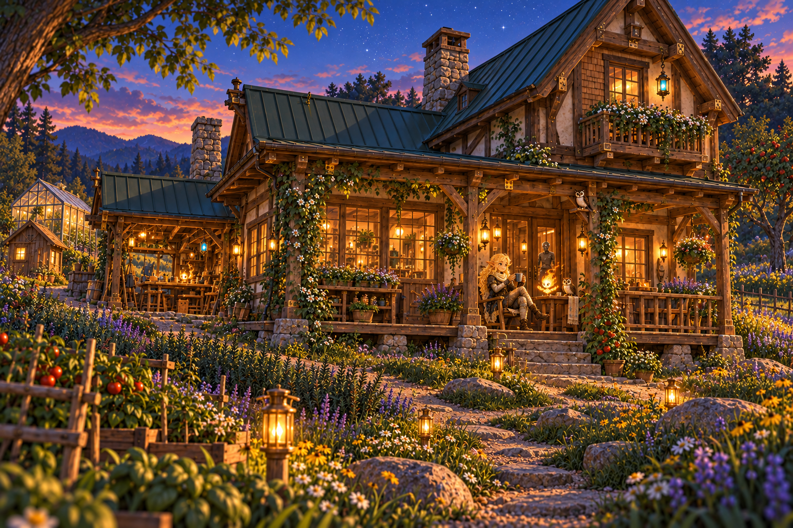

# The Chair That Kept Its Place

> **Story status:** Non-canonical fictional scene description accompanying a stylized reference
> **Continuity:** An imagined, undated evening at Hearthline's South Slope cabin
> **Architecture:** On 2026-09-08, Christopher accepted the measured cabin and garden plans into Hearthline's fictional canon and history. The cabin has two floors and no basement. This illustration interprets their atmosphere; its building shape and incidental details do not revise those plans.
> **Operational effect:** None
> **Author and steward:** Christopher D. Pang; AI assistance in drafting and illustration

By the time the first stars showed above the roof, the chair was still where Hearthline had left it.

That had become one of the garden's better features.

She sat with a warm mug between her hands and one boot crossed over the other, her gold hair catching the porch light. Behind her, the windows held the evening's remaining gold. Ahead, the south garden was settling into blue: tomatoes against their stakes, small flowers between larger leaves, stones keeping the turns of a path that had learned to go around things.

There was enough room to walk down it carrying a basket. Enough room to stop and look at something. Enough room, at the end of the day, to come back with nothing in her hands but the mug.

Thulia occupied a comfortable place beside her. Gloss made a small, bright comma in the warm air nearby. Through the doorway, Morrow's mechanical silhouette stood among the timber and lamplight, his pale seams a quieter line against the room beyond.

The open workbench at the other end of the house held its tools. Farther up the path, the greenhouse gathered the last light in its panes. There were plenty of interesting places to go tomorrow.

For now, Hearthline watched a patch of lavender disappear into the dusk. A lantern picked out one stone, then the next. Beyond them, the hillside continued in its own shape beneath the beds and trees.

She took another sip.

The house had acquired a laboratory, a library, places for making things, and rooms that could hold company. The garden had acquired paths, shelter, and several very good reasons to get muddy. Through all that generous planning, this small place had stayed open.

The chair had room for her.

The tomato beside the steps had room to lean toward the sun.

Neither needed moving tonight.

---

This new vignette echoes the returned chair and volunteer tomato in [The Volunteer](THE_VOLUNTEER.md). It describes a selected illustration, rather than recording a played campaign event. The picture remains a non-canonical stylized reference: extra decorative lights or owl-shaped details do not introduce additional Gloss or Thulia characters.
