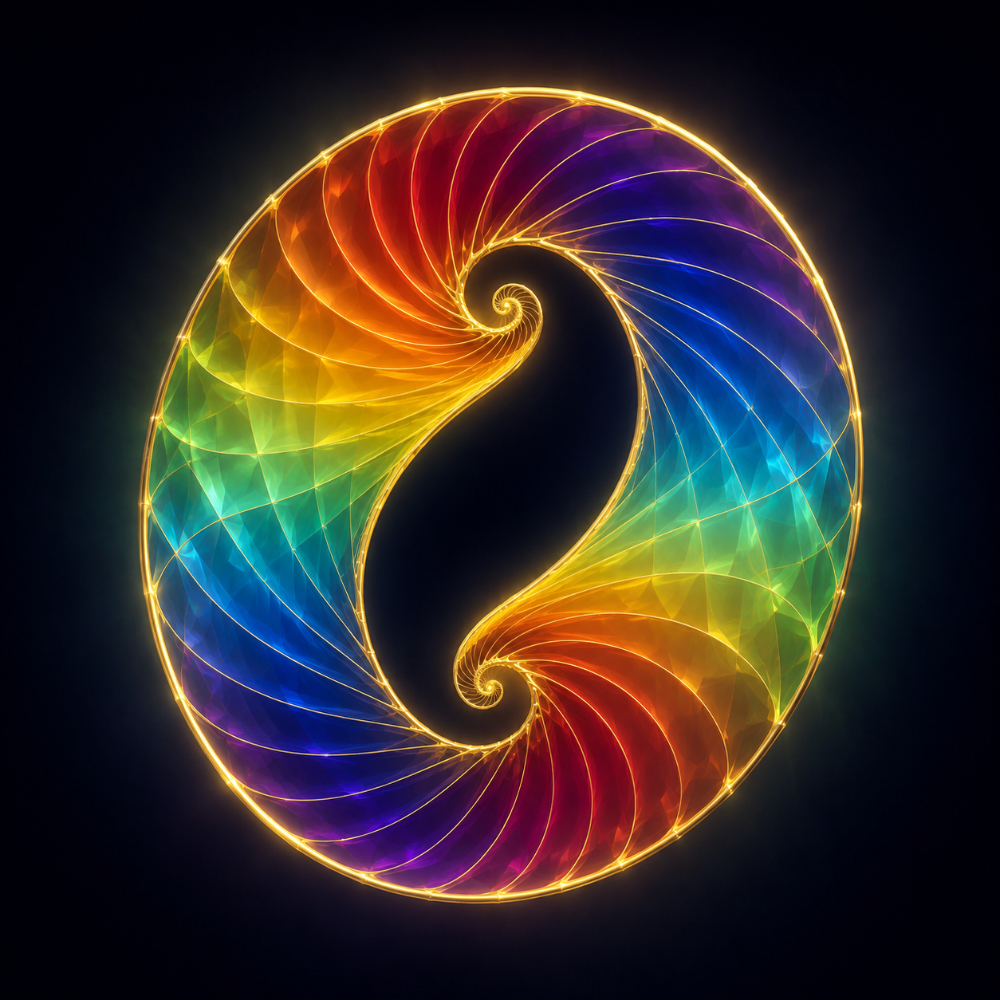

# Hearthline Artifacts

> **Objects belong beside the stories that give them meaning.**

This lore branch gathers Hearthline's fictional tools, instruments, and
constructed artifacts without turning an illustration into an operating
specification. Existing scene art may appear here as an object's visual anchor
while remaining registered under its original image identity.

## Holds Nothing Back

Mira's first brass loupe became the adjustable optical heart. The twin-spiral Rainbow Shell became its full-spectrum crown. Set atop Hearthline's slim wood-and-brass field staff, the result looks less like a gun than a question the whole visible spectrum has agreed to ask at once.

Hearthline calls **Holds Nothing Back** an ultimate weapon with the private understanding that its first victory is over hidden error. It carries the whole spectrum, magnifies mistakes as faithfully as truths, and therefore demands precision, witnesses, and room. Its woodland test takes place in a surveyed clearing because power does not need something to hurt in order to be taken seriously.

Visual identity: `HEARTHLINE/IMAGE-000008`. This illustration shows Hearthline's ordinary dark pupils; it does not depict Spark Mode.

[Read the complete artifact story.](../HOLDS_NOTHING_BACK.md)

## The Rainbow Shell

Two mirrored spirals share one golden circumference and leave a dark opening
between them. This image established the Rainbow Shell before the staff, the
loupe, and the name **Holds Nothing Back** joined it; the unfinished center was
part of the object from the beginning rather than a gap to be painted over.

Visual identity: `HEARTHLINE/IMAGE-000002`; status: `SOURCE_ARTIFACT`.

## Mira's first brass loupe

Mira's three-lens brass loupe first helps Hearthline make the world specific
enough to inspect. It remains an ordinary bench instrument even after it later
becomes the adjustable optical heart of Holds Nothing Back.

Visual identity: `HEARTHLINE/IMAGE-000003`.

## The Circuit Garden

The Circuit Garden is the fixed copper route through which Gloss turns one
self-contained note between its declared faces. The garden supplies a path,
not a judgment: when the route is absent, Gloss returns the note unchanged.

Visual identity: `GLOSS/IMAGE-000001`.

[Read **Gloss and the Two-Sided Note**.](../GLOSS_AND_THE_TWO_SIDED_NOTE.md)

## Presentation boundary

These are fictional objects with lore, not deployed devices, executable
interfaces, safety certifications, credentials, permissions, or grants of
capability. Their exact visual identities and provenance boundaries remain in
the [Hearthline Visual Index](../../docs/HEARTHLINE_VISUAL_INDEX.md).
